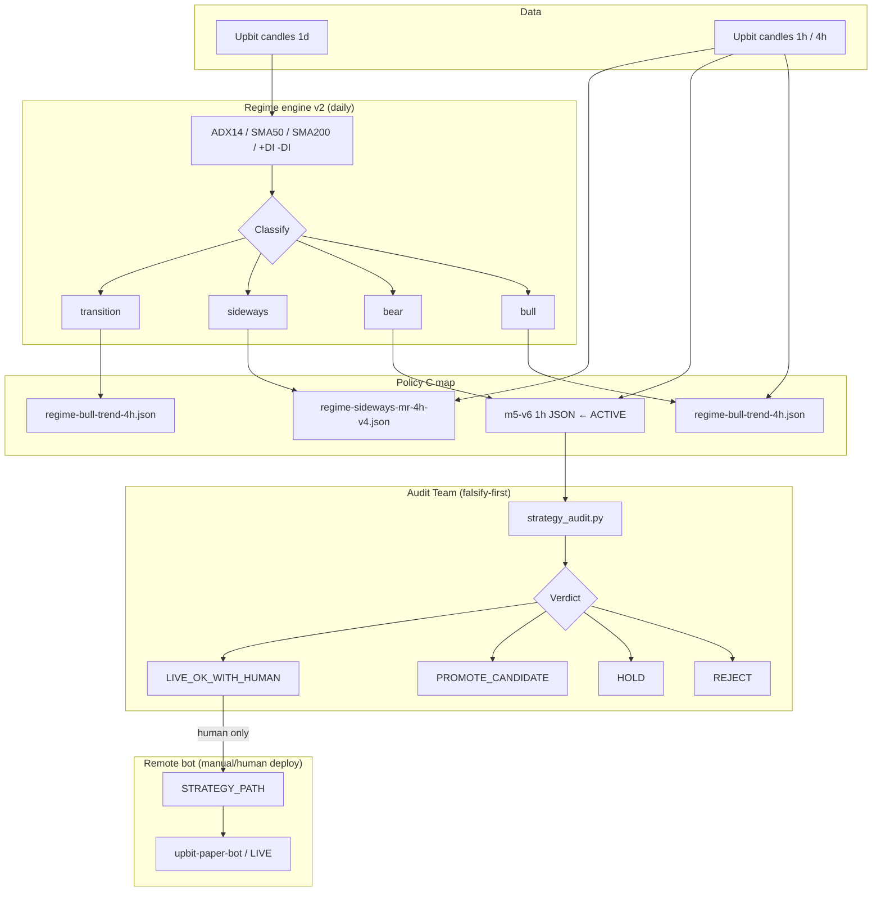
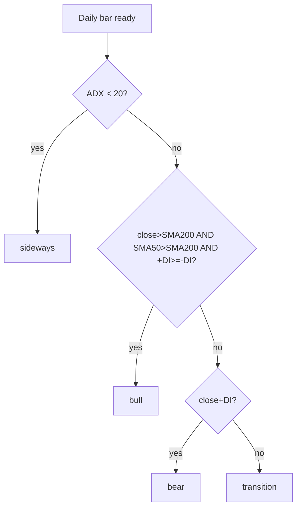
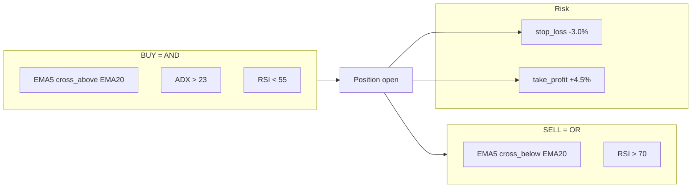
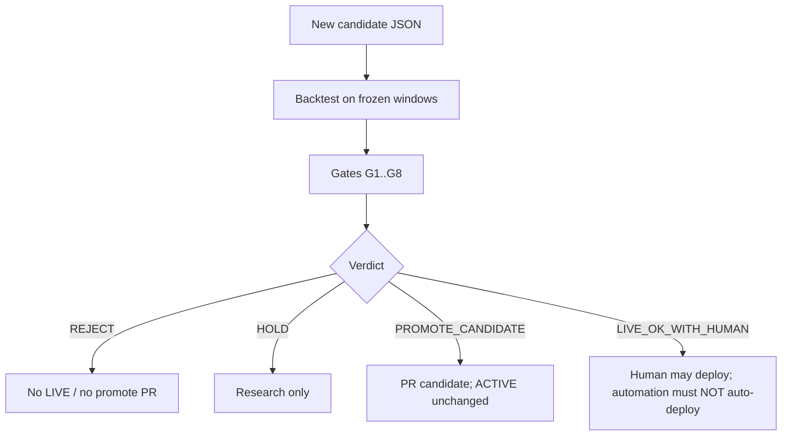

# KRW-BTC Strategy Pack (Agent-Readable)

> **Purpose**: Shareable, machine-readable summary of the live Upbit KRW-BTC strategy system.  
> **Audience**: Humans + coding agents.  
> **Not**: Investment advice. Backtest-only toolkit metrics; live bot is a separate deploy.

| Field | Value |
|-------|-------|
| Updated | 2026-07-28 |
| Market | `KRW-BTC` (Upbit KR) |
| Active slug | `krw-btc-1h-ema-adx23-rsi55-sl3-tp45-m5-v6` |
| Active file | `strategies/krw-btc-1h-ema-adx23-rsi55-sl3-tp45-m5-v6.json` |
| Bot mode | LIVE (real orders possible) |
| Audit policy | `reports/review-state/audit-policy.json` |

---

## 0. Friend scoreboard — CAGR / MDD / PF

> Toolkit stdout only. Fees included. **No** slippage / order-book / partial fills.  
> Past backtest ≠ future guarantee. Not investment advice.

### Headline window (최근 ~6개월) `2026-01-26 ~ 2026-07-26` UTC · ACTIVE **m5-v6**

| Metric | Value | vs Buy&Hold |
|--------|------:|-------------|
| **CAGR** | **+39.35%** | B&H total return **-26.37%** (same window) |
| **MDD** | **-2.03%** | shallow drawdown vs big market drop |
| **PF** (Profit Factor) | **4.18** | before fees label in toolkit: `(before fees)` on WR/PF lines; total return is after fees |
| Total Return | +17.88% | |
| Trades / Win Rate | 26 / 50% | |

```text
┌──────────────────────────────────────────────┐
│  m5-v6 · 2026-01-26 → 2026-07-26 (UTC)       │
│  CAGR  +39.35%                               │
│  MDD    -2.03%                               │
│  PF      4.18                                │
│  Return +17.88%  |  B&H -26.37%  |  n=26     │
└──────────────────────────────────────────────┘
```

### Longer look `2025-07-26 ~ 2026-07-26` (~1y)

| Metric | m5-v6 |
|--------|------:|
| **CAGR** | **+13.98%** |
| **MDD** | **-6.44%** |
| **PF** | **2.15** |
| Total Return | +13.98% |
| Benchmark (B&H) | -40.97% |
| Trades | 45 |

### Honesty panel (감사팀이 강제하는 구간 — 낙관 금지)

| Window | CAGR | MDD | PF | Total | B&H | Trades |
|--------|-----:|----:|---:|------:|----:|-------:|
| Early OOS `2025-07-26~2026-01-26` | -6.46% | -6.44% | 0.85 | -3.31% | -19.83% | 19 |
| Holdout `2024-11-03~2025-04-24` | -3.16% | -11.84% | 1.04 | -1.50% | +37.95% | 21 |
| Shallow bear stress `2024-08-09~2024-10-03` | -7.84% | -4.46% | 0.93 | -1.22% | -4.32% | 8 |

**Read this like an auditor:** recent 6m looks strong (CAGR/MDD/PF), but early OOS PF&lt;1 and holdout underperforms a roaring B&H tape. That is why LIVE changes require `strategy_audit.py`, not vibes.

### vs previous live candidate (same 6m window)

| | **m5-v6 (ACTIVE)** | m5-v3 (prev) |
|--|--:|--:|
| CAGR | **+39.35%** | +51.19% |
| MDD | **-2.03%** | -2.94% |
| PF | **4.18** | 2.92 |
| Total Return | +17.88% | +22.75% |
| Trades | 26 | 42 |

v3 has higher CAGR on this window; v6 was chosen after audit for better shallow-bear / OOS balance + higher PF, not max CAGR chase.

---

## 1. System overview



---

## 2. Regime classification (engine v2)

**Input timeframe**: daily.  
**Min run**: 14 days (short runs absorbed).

| Regime | Rules (all must hold) |
|--------|------------------------|
| `sideways` | `ADX < 20` |
| `bull` | `ADX >= 20` AND `close > SMA200` AND `SMA50 > SMA200` AND `+DI >= -DI` |
| `bear` | `ADX >= 20` AND `close < SMA200` AND `SMA50 < SMA200` AND `close < SMA50` AND `-DI > +DI` |
| `transition` | else (includes recovery: price above SMA50 while broader structure still weak) |



**Why v2**: Old labels marked 2024-08..11 as bear while price rose (~+13%). v2 splits that into true bear + sideways/transition recovery.

---

## 3. Active live strategy (m5-v6)

### 3.1 Identity

```yaml
slug: krw-btc-1h-ema-adx23-rsi55-sl3-tp45-m5-v6
name: KRW-BTC 1h EMA ADX23 RSI55 SL3/TP4.5 m5-v6
market: KRW-BTC
exchange: kr
timeframe: 1h
stop_loss_pct: 3.0
take_profit_pct: 4.5
```

### 3.2 Indicators

| Ref | Type | Params |
|-----|------|--------|
| `ma_short` | EMA | period 5 |
| `ma_long` | EMA | period 20 |
| `adx14` | ADX | period 14 |
| `rsi14` | RSI | period 14, signal EMA 9 |

### 3.3 Entry / exit



**Plain language**
- Buy only when short EMA crosses above long EMA, trend strength is present (`ADX>23`), and RSI is not already hot (`RSI<55`).
- Sell on dead cross or RSI overbought (`>70`), or hit SL/TP.

### 3.4 What ADX means here

- ADX = trend **strength** only (not direction).
- Direction uses `+DI` / `-DI` in the **regime** layer.
- Filter intent: skip weak / choppy 1h signals.

---

## 4. Sibling strategies (policy map)

| Regime | File | TF | Idea |
|--------|------|----|------|
| bull | `strategies/regime-bull-trend-4h.json` | 4h | EMA8/21 cross, SL10 / TP40 |
| bear (ACTIVE) | `strategies/krw-btc-1h-ema-adx23-rsi55-sl3-tp45-m5-v6.json` | 1h | See §3 |
| sideways | `strategies/regime-sideways-mr-4h-v4.json` | 4h | RSI/BB mean-reversion + ADX upper bound |
| transition | same as bull 4h | 4h | Participation during recovery/ambiguous |

Rejected / alt (do not auto-live):
- `...-m5-v7.json` — **Audit REJECT** (too few primary trades)
- `...-m5-v6b.json` / `...-m5-v6c.json` — **Audit HOLD** (complexity tax)

---

## 5. Audit Team (anti-optimism gate)



### Gate cheat-sheet

| ID | Check | Intent |
|----|-------|--------|
| G1 | Primary window min trades | Block 1-trade miracles |
| G2 | Holdout not collapse vs baseline | Catch in-sample fit |
| G3 | Early OOS not much worse | Falsify recent-fit |
| G4 | Shallow-bear stress ≥ baseline | Protect known weak spot |
| G5 | Complexity tax | Extra filters need extra edge |
| G6 | MDD guard | Risk not silently worse |
| G8 | Multiple-testing bar | Large sweeps need tighter OOS |

**Run**

```bash
python3 scripts/strategy_audit.py \
  --candidate strategies/<candidate>.json \
  --baseline strategies/krw-btc-1h-ema-adx23-m5-v3.json \
  --n-trials <N> \
  --out reports/audit/<name>-audit.json
```

**Sample result (2026-07-28)**  
- v7 vs v3 → `REJECT` (G1: primary trades 7 < 8)  
- v6 vs v3 → `LIVE_OK_WITH_HUMAN`  
→ ACTIVE / bot switched to **v6**.

---

## 6. Backtest facts (toolkit stdout; historical only)

> Do not treat as forecast. Fees modeled; slippage / book / partial fills **not** modeled.

| Window | m5-v6 | Notes |
|--------|-------|-------|
| Primary 2026-01-26..2026-07-26 | ~+17.88% / ~26 trades | Baseline v3 was ~+22.75% / 42 trades |
| Early OOS 2025-07-26..2026-01-26 | ~-3.31% | Better than v3 ~-8.96% |
| Shallow bear 2024-08-09..2024-10-03 | ~-1.22% | Better than v3 ~-10.08% |
| Holdout 2024-11-03..2025-04-24 | ~-1.5% | Better than v3 ~-11.94% |

Regime policy compound (segment chain, earlier run): improved after sideways/regime fixes; see `reports/sweeps/` and `reports/review-state/regime-engine.json`.

---

## 7. Monthly automation contract

1. Cursor Automation cron (UTC): `0 9 1 * *` (1st of month review of prior month).  
2. Prompt template: `docs/monthly-automation-prompt.md`.  
3. Improver may propose ≤2 edits.  
4. Audit Team verdict is mandatory.  
5. **Forbidden**: auto SSH / auto `STRATEGY_PATH` change.  
6. LIVE only after human reads audit + approves.

---

## 8. File index (for agents)

```text
strategies/ACTIVE_STRATEGY
strategies/krw-btc-1h-ema-adx23-rsi55-sl3-tp45-m5-v6.json
strategies/regime-bull-trend-4h.json
strategies/regime-sideways-mr-4h-v4.json
scripts/regime_select.py
scripts/regime_engine_v2.py
scripts/strategy_audit.py
reports/review-state/regime-engine.json
reports/review-state/audit-policy.json
reports/audit/
docs/monthly-automation-prompt.md
docs/KRW-BTC-전략-공유요약.pdf
```

---

## 9. Disclaimers

- Not investment advice; no recommendation of assets, timing, or strategy for profit.  
- Backtests are historical and do **not** guarantee future results.  
- LIVE bot can place **real orders**.  
- Responsibility for trading actions remains with the user.

---

## 10. One-screen copy block

```text
ACTIVE m5-v6 | KRW-BTC 1h | EMA5x20 + ADX>23 + RSI<55 | SL3/TP4.5
6m (26~07-26): CAGR +39.35% | MDD -2.03% | PF 4.18 | Ret +17.88% | B&H -26.37%
1y (25-07~26-07): CAGR +13.98% | MDD -6.44% | PF 2.15 | B&H -40.97%
Audit: early PF 0.85 / holdout lags B&H — not a free lunch
Gate: strategy_audit.py before LIVE; automation = PR only
```
