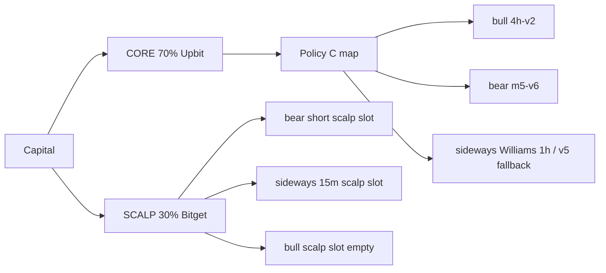

# Dual-sleeve capital allocation (CORE + SCALP)

> Intent: **split capital**, not replace Policy C.  
> Config source of truth: [`config/sleeves.json`](../config/sleeves.json)

## Why

One Upbit bot can only run one `STRATEGY_PATH`. Mixing swing (4h/1h) and scalps on the same wallet forces constant regime-file swaps and blocks shorts (Upbit spot).

Split:

| Sleeve | Venue | Role | Capital (default) |
|--------|-------|------|-------------------|
| **CORE** | Upbit spot (`upbit-paper-bot`) | Policy C swing / MR | 70% |
| **SCALP** | Bitget UTA futures (Freqtrade) | Short-capable, faster TF | 30% |

Weights are human knobs — do not auto-tune from one month of live PnL.



## Sideways separation (required)

| Sleeve | Strategy | Notes |
|--------|----------|-------|
| CORE | `regime-sideways-mr-1h-williams-v1` (dwell≥7) else `…-4h-v5` | Already LIVE. Treat as **swing MR**, not scalp. |
| SCALP | `SidewaysScalp15mBbV1` (research draft) | Independent Bitget long+short 15m BB fade. Validate before funding. |

Do **not** demote Williams to “make room” for a scalp — fund the scalp from the SCALP wallet instead.

## Bear separation

| Sleeve | Strategy | Status |
|--------|----------|--------|
| CORE | `m5-v6` long-biased 1h | LIVE — keep |
| SCALP | `BearShortBreakdownVolV6` (and prior v1–v5) | Research falsified so far — slot open |

## Ops rules

1. CORE and SCALP never share a position book.
2. Promoting a scalp never edits `POLICY` in `remote_regime_switch.py` unless you explicitly want CORE changed.
3. Premium / kimchi overlay stays on CORE until SCALP has its own contract.
4. Empty scalp slots → that % stays in cash / idle wallet (do not fold into CORE silently without a decision).

## Status helper

```bash
python scripts/sleeve_status.py
```

## Related research

- Bear short hunt: `reports/improve/20260729-bear-short-scalp.md`
- Williams LIVE promote: `reports/improve/20260729-williams-live-promote.md`
