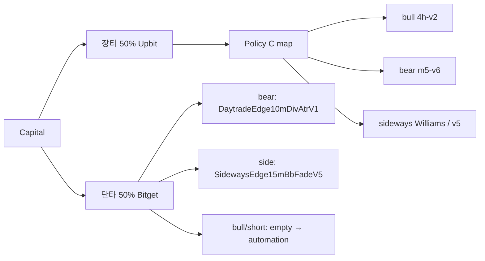

# Dual-sleeve capital allocation (장타 CORE + 단타 SCALP)

> Intent: **split capital**, not replace Policy C.  
> Config source of truth: [`config/sleeves.json`](../config/sleeves.json)  
> SCALP live map: [`config/scalp-live-map.json`](../config/scalp-live-map.json) · [`docs/scalp-live-playbook.md`](scalp-live-playbook.md)

## Split (human-frozen **2026-07-30**: 장타 5 / 단타 5)

| Sleeve | 한글 | Venue | Role | Capital |
|--------|------|-------|------|---------|
| **CORE** | 장타 | Upbit spot (`upbit-paper-bot`) | Policy C swing / MR | **50%** |
| **SCALP** | 단타 | Bitget UTA futures (Freqtrade) | Regime scalp map | **50%** |

**빗겟:업비트 = 5:5** because each sleeve owns one venue.

Do not auto-tune weights from one month of live PnL.



## Sideways separation (required)

| Sleeve | Strategy | Notes |
|--------|----------|-------|
| CORE | `regime-sideways-mr-1h-williams-v1` (dwell≥7) else `…-4h-v5` | 장타 MR |
| SCALP | `SidewaysEdge15mBbFadeV5` | LIVE 단타; prior `SidewaysScalp15mBbV1` falsified |

## Bear separation

| Sleeve | Strategy | Status |
|--------|----------|--------|
| CORE | `m5-v6` long-biased 1h | LIVE 장타 |
| SCALP long | `DaytradeEdge10mDivAtrV1` | LIVE 단타 (promoted edge) |
| SCALP short | — | empty — automation hunt (no mirrors) |

## Ops rules

1. CORE and SCALP never share a position book.
2. Promoting a scalp never edits Policy C unless explicitly requested.
3. Premium / kimchi overlay stays on CORE until SCALP has its own contract.
4. Empty scalp slots → that capital stays cash in the SCALP wallet.

## Status helper

```bash
python scripts/sleeve_status.py
```
