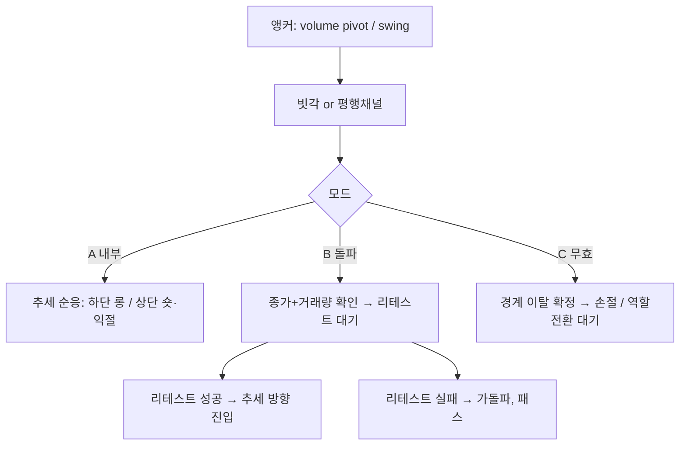

# 인범TV 빗각(채널) 매매법 — 리서치 플레이북

> **모토**: [`docs/motto.md`](motto.md) — 단순 원칙 · 기계 집행 · (기각 통과 후) 우상향.  
> **목적**: 공개 자료 + 커뮤니티 해석을 모아, 재현 가능한 **규칙 세트**와 **검증 가능한 가설**로 바꾼다.  
> **한계**: 인범TV가 출판한 공식 룰북은 공개되어 있지 않다. 아래는 2차 자료·일반 채널/추세선 이론으로 재구성한 **작업용 스펙**이다.  
> **투자 조언 아님**. 문서화·백테스트용.  
> **2026-07-29 우선순위**: 새 인코딩 중단. 문헌·수동 표본 먼저 → [`docs/research/trendline-parallel-channel-literature.md`](research/trendline-parallel-channel-literature.md)

| Field | Value |
|-------|-------|
| Updated | 2026-07-29 |
| Alias | 빗각 = **브랜드명**; 본체는 고전 **trendline + parallel channel** |
| Core claim | 의미 있는 고·저(특히 거래량 터진 변곡)를 이은 채널이 지지·저항·리테스트 타점이 된다 |
| Automation gap | 작도 자체는 이산 지표 JSON에 없음 → 프록시 또는 커스텀 pivot 엔진 필요 |
| Literature | [`docs/research/trendline-parallel-channel-literature.md`](research/trendline-parallel-channel-literature.md) |
| Community / ICT | [`docs/research/bitgak-community-psychology-synthesis.md`](research/bitgak-community-psychology-synthesis.md) |
| Prior research | Short-TF **LR(40)±2σ** 프록시 v1–v3 **기각** — [`reports/improve/20260729-diagonal-빗각-scalp.md`](../reports/improve/20260729-diagonal-빗각-scalp.md) |

---

## 0. 한 줄 정의

**거래량이 실린 고점–고점 / 저점–저점 / 변곡점을 직선으로 이어 채널(빗각)을 만들고, 그 경계에서의 반등·이탈·리테스트를 기준으로 대응한다.**

공개 해석의 공통분모:

- “빗각”은 신기한 지표가 아니라 **추세선(+평행 채널)** 의 별칭·브랜드에 가깝다. (brunch: 활용 100% 동일)
- 인범TV 스타일은 **보조지표를 거의 안 쓰고 빗각만으로** 대응하는 쪽에 가깝다 (시청자/리뷰 측 진술).
- 엣지는 “선 긋기”보다 **어느 점을 의미 있다고 볼지(거래량·변곡)**, **돌파 후 리테스트**, **빠른 무효화(손절)** 에 있다.
- 깊게 파려면 인범 클립보다 **Edwards–Magee / Murphy / StockCharts 채널 문헌 + 수동 표본**이 본체다 → research 노트.

---

## 1. 출처 맵 (공개)

| 출처 | 요지 | URL |
|------|------|-----|
| 투진사 (네이버 프리미엄) | 인범의 ‘빗각’ = 추세선. 고/저/고고저/저저고. TF는 주→일→4h. 거래량 터진 자리는 매물대. 좁은 TF에 선 난사 금지 | https://contents.premium.naver.com/tujunsa/bitcoin/contents/250901120032929yh |
| brunch @urbantrader | 빗각≡추세선. **돌파 후 리테스트**가 단순 터치보다 낫다. 보수적 작도. ABC 되돌림(B)이 핵심 | https://brunch.co.kr/@urbantrader/56 , `/62` |
| 시그비트 패러럴 채널 | 3-touch, 내부매매 vs 돌파+리테스트, 거래량으로 진·가돌파, 미들라인 | https://sigbtc.pro/ko/community/education-board/post/6871 |
| Steemit 시청자 리뷰 | 인범 = 조인범. **빗각 하나로만** 트레이딩한다는 관찰 | https://steemit.com/kr/@banguri/2025-1-3-25-4 |
| 자본주의빌런 등 | 빗각 ≈ 추세선+채널 (비공식 관찰) | https://cap-villian.tistory.com/972 |

공식 강의/유료 스터디 내용은 포함하지 않음 (저작·접근 제한).

---

## 2. 작도 규칙 (작업용 스펙)

### 2.1 앵커 점 (무엇을 이을까)

우선순위 (높→낮):

1. **거래량 폭발 캔들의 고점 또는 저점**  
   - “거래량이 터진 자리 = 고/저가 나오거나 매물대(물림·본전·손절 심리)가 쌓인 자리”
2. **스윙 피벗** (좌우보다 뚜렷한 고/저)
3. **역할 전환된 변곡** (이전 저항→지지, 이전 지지→저항)

앵커 조합 (투진사 표현 정리):

| 이름 | 점 | 결과 |
|------|----|------|
| 고–고 | 하락/저항 빗각 | 상단 저항선 |
| 저–저 | 상승/지지 빗각 | 하단 지지선 |
| 고–고–저 | 평행 채널 후보 | 상단 2점 + 하단 1점으로 폭 확정 |
| 저–저–고 | 평행 채널 후보 | 하단 2점 + 상단 1점으로 폭 확정 |

### 2.2 채널 확정 (3-touch)

1. 추세 쪽 2점 연결 (상승=저–저, 하락=고–고)
2. 반대 극점에 **평행 복사**
3. 반대선에 **최소 1회 터치** → 합계 3터치면 “유효 채널”
4. 억지 평행이면 채널이 아니라 **쐐기/삼각** → 별도 취급

### 2.3 타임프레임·도구

- **넓은 TF 먼저**: 주봉 → 일봉 → 4h (신뢰↑, 타점↓)
- 좁은 TF에 빗각을 많이 그으면 신호가 충돌한다 → **상위 빗각 소수 + 하위 수평선 다수**
- BTC 장기 채널은 **로그 차트**가 잘 맞는 경우가 많음
- TV: Trend Line / Light Ray / Parallel Channel / Fib Channel(1:1로 쓰는 변형도 언급됨)

### 2.4 채널의 4요소

| 요소 | 역할 |
|------|------|
| 상단선 | 저항 / 숏·익절 / 상방돌파 기준 |
| 하단선 | 지지 / 롱 / 하방이탈=추세 약화·전환 |
| 미들라인 | 강약 경계, 부분청산, 중간 지지·저항 |
| 채널 폭 | 목표가 ≈ 돌파 후 **폭만큼** 투영 |

---

## 3. 매매 모드 (전략 분해)

빗각은 한 기법이 아니라 **3개 모드**로 쪼개야 검증이 된다.



### Mode A — 채널 내부 (추세 순응)

| 채널 | 진입 | 1차 청산 | 2차 | 손절 |
|------|------|----------|-----|------|
| 상승 | 하단 터치 + 반등 확인 | 미들 | 상단 | 하단 **종가** 이탈 |
| 하락 | 상단 터치 + 반락 확인 | 미들 | 하단 | 상단 **종가** 돌파 |
| 수평 | 양방향 가능 | — | 반대선 | 돌파 확정 |

규칙: **추세 방향으로만**. 상승채널 상단 숏 / 하락채널 하단 롱은 기본 off (역추세는 별도 가설).

### Mode B — 돌파 + 리테스트 (공개 해석상 핵심)

1. **종가**가 채널 밖 (꼬리만 = 미확정)
2. 돌파봉 **거래량 ≥ N× 평균** (관례 2× 후보)
3. 추격 금지 → **돌파선 리테스트** 대기
4. 리테스트에서 지지/저항 유지 + 방향 재개 시 진입
5. 손절: 리테스트 실패(채널 안으로 재진입 확정) 바로 밖
6. 목표가: 채널 폭 투영 또는 다음 상위 빗각

brunch 측 요약: *단순 추세선 터치보다 돌파 후 리테스트가 승률·손익비가 낫다. 작도는 보수적으로.*

### Mode C — 무효화 / 대응

- 상승채널 **하단 이탈 + 거래량** → 추세 약화/전환 후보 (현물: 축소·관망, 선물: 숏 후보)
- 하락채널 **상단 돌파 + 거래량** → 상승 전환 후보
- 이탈 후 **옛 경계가 반대 역할**로 바뀌는지(polarity)를 다음 타점으로 씀

### 거래량 필터 (공통)

| 상황 | 해석 |
|------|------|
| 추세 방향 이동 + vol↑ / 되돌림 vol↓ | 건강한 채널 |
| 되돌림에서 vol 폭증 | 추세 약화 경고 |
| 돌파 + vol 부족 | **가짜 돌파** 우선 가정 |
| vol 터진 고/저 | 이후 빗각 **앵커**로 고정 |

---

## 4. 운영 체크리스트 (수동 차트)

1. 주봉에서 굵은 빗각/수평 1~2개만
2. 일봉에서 volume spike 캔들 표시 → 앵커 후보
3. 4h에서 채널 3-touch 확정
4. 모드 A/B 중 하나만 그날의 primary로 선택
5. 진입 전: 종가·거래량·리테스트 3종 체크
6. 무효 조건 미리 적고 진입 (경계 밖 N% 또는 다음 봉 종가)

---

## 5. 이미 돌린 실험 (2026-07-29) — 기각

인코딩: 손작도 빗각 ≈ **LINEARREG(40) ± 2σ** 레일. Bitget ETH 선물 5m/15m.

| Ver | 아이디어 | 코드 | 판정 |
|-----|----------|------|------|
| v1 | 기울기 순응 + 레일 터치 리젝트 | `DiagonalChannelScalpV1.py` | **falsified** (3/3 PF≪1) |
| v2 | 레일 실패돌파 후 리테스트 | `DiagonalBreakRetestV2.py` | **falsified** |
| v3 | v1을 15m | `DiagonalChannelScalp15mV3.py` | **falsified** (2/3) |
| maker stress | 수수료 0.02% | config maker | PF 0.89 — 수수료만으론 엣지 없음 |

상세: [`reports/improve/20260729-diagonal-빗각-scalp.md`](../reports/improve/20260729-diagonal-빗각-scalp.md)

**교훈**

1. LR 채널은 “거래량 터진 고·저” 앵커가 **아님** → 사용자 정의와 불일치.
2. 5m/15m은 스킵 필터·작도 경로의존을 봇이 못 따라감.
3. 다음 실험은 **volume-pivot 앵커 + 상위 TF(1h/4h/1d)** 로 갈아타야 함. 파라미터 미세조정 금지.

---

## 5b. V1-day (2026-07-29) — 기각

데이 트레이딩 요구(BTC only, ~3–4회/일, 저유동성 스킵)로 TF를 **15m**으로 내려 구현.

| Item | Value |
|------|-------|
| Code | `freqtrade-research/user_data/strategies/DiagonalVolumePivotDayV1.py` |
| Report | [`freqtrade-research/reports/20260729-diagonal-volume-pivot-day-v1.md`](../freqtrade-research/reports/20260729-diagonal-volume-pivot-day-v1.md) |
| W1/W2/W3 | PF 1.06 / 0.79 / 0.60 → **falsified** |
| Avg trades/day | 1.5–2.6 (목표 3–4에 미달·근접) |

Volume-pivot 앵커로도 Mode A 첫 터치 MR은 수수료 하에서 엣지 없음. 파라미터 재튜닝 금지.

---

## 5c. V2-day (2026-07-29) — 게이트 통과·실전 미달

Mode B (실패돌파→리테스트). V1 hypers 그대로.

| Item | Value |
|------|-------|
| Code | `DiagonalVolumePivotBreakRetestDayV2.py` |
| Report | [`freqtrade-research/reports/20260729-diagonal-volume-pivot-day-v2.md`](../freqtrade-research/reports/20260729-diagonal-volume-pivot-day-v2.md) |
| W1/W2/W3 PF | 0.66 / 1.10 / 1.16 → PF 기각 기준(≥2/3)에는 **미해당** |
| Avg trades/day | 0.5–1.3 (**3–4 목표 실패**) |
| Promote? | **No** — n 작고 수익≈노이즈 |

---

## 5d. V1-gate (2026-07-29) — 기각

Soft daily gate: bull→long only, bear→short only, else→both.

| Item | Value |
|------|-------|
| Code | `DiagonalVolumePivotDayGateV1.py` |
| Report | [`freqtrade-research/reports/20260729-diagonal-volume-pivot-day-gate-v1.md`](../freqtrade-research/reports/20260729-diagonal-volume-pivot-day-gate-v1.md) |
| W1/W2/W3 PF | 0.90 / 2.58 / 0.53 → **falsified** |
| Note | W2 bear-shorts worked; W3 bear-gate shorted a +10% rally |

---

## 5e. Human-Soft (2026-07-29) — 기각

인간형 용인: pierce 0.4%, width/slope 품질, 쿨다운 4봉. 빈도↑ 기대값↓.

| Item | Value |
|------|-------|
| Code | `DiagonalHumanSoftDayV1.py` |
| Report | [`freqtrade-research/reports/20260729-diagonal-human-soft-day-v1.md`](../freqtrade-research/reports/20260729-diagonal-human-soft-day-v1.md) |
| W1/W2/W3 PF | 0.77 / 0.66 / 0.89 → **falsified** 3/3 |

교훈: OHLC만으로 “스킵 필터”를 흉내 내면 신호가 늘 뿐, 재량 엣지는 안 생김.

---

## 5f. Multi-TF 4h→15m (2026-07-29) — 기각

사람이 쓰는 방식(상위 작도·하위 진입). Mode A 유지, 레일만 4h.

| Item | Value |
|------|-------|
| Code | `DiagonalMultiTfDayV1.py` |
| Report | [`freqtrade-research/reports/20260729-diagonal-multi-tf-day-v1.md`](../freqtrade-research/reports/20260729-diagonal-multi-tf-day-v1.md) |
| W1/W2/W3 PF | 0.61 / 0.20 / 0.40 → **falsified** 3/3 |
| Trades/day | 0.2–0.9 (너무 희소) |

다음 후보(종료 아님): **1h→15m**, **4h+Mode B 돌파 리테스트**, **레일=필터(#4)**.

---

## 5g. US session + Multi-TF (2026-07-29) — 기각

운영 제약 확정: BTC / 미국장(RTH) / 저빈도 OK / 4h 작도·15m 진입.

| Variant | Window | Result |
|---------|--------|--------|
| Open 09:30–12:30 | 2w×3 | 0–4 trades, useless |
| RTH 09:30–16:00 | ~30d×3 | PF 0.46 / 0 / 0 → **falsified** |

Report: [`freqtrade-research/reports/20260729-diagonal-us-session-mtf.md`](../freqtrade-research/reports/20260729-diagonal-us-session-mtf.md)

Mode A 첫 터치는 세션을 맞춰도 안 산다 → **진입 논리 교체**가 다음.

### QQQ 이식 (2026-07-29)
`QQQ/USDT:USDT` + 동일 US-RTH Multi-TF Mode A → PF 0.40 / 0.40 / 0 (**기각**).  
Report: [`freqtrade-research/reports/20260729-diagonal-qqq-us-rth-mtf.md`](../freqtrade-research/reports/20260729-diagonal-qqq-us-rth-mtf.md)

고정 스택 후보: **QQQ · US RTH · 4h 작도 · Mode B 진입**.

---

### QQQ Mode B Frozen (2026-07-29) — 기각

카드 freeze 후 첫 인코딩. Hypers 재튜닝 없음.

| Item | Value |
|------|-------|
| Code | `DiagonalQqqModeBFrozenV1` |
| Card | [`docs/research/mode-b-rule-card-frozen.md`](research/mode-b-rule-card-frozen.md) |
| Report | [`freqtrade-research/reports/20260729-diagonal-qqq-mode-b-frozen.md`](../freqtrade-research/reports/20260729-diagonal-qqq-mode-b-frozen.md) |
| W1/W2/W3 | +0.99% / −0.91% / −2.64% (PF n/a / 0 / 0.27) → **falsified** |

---

## 6. 자동화·백테스트로 옮길 때

### 6.1 왜 Upbit JSON에 바로 안 들어가나

카탈로그에 **동적 추세선/평행채널** 타입이 없다.  
“빗각”은 **상태 머신 + 피벗 기하** → ConditionGroup만으로는 부족.

### 6.2 다음 검증 백로그 (우선순위)

| ID | 가설 | 구현 | TF | 상태 |
|----|------|------|----|------|
| ~~S1~~ | LR 레일 터치 MR | freqtrade v1–v3 | 5m/15m ETH | **기각** |
| ~~V1-day~~ | vol-pivot 채널 Mode A + 일봉 유동성 게이트 | `DiagonalVolumePivotDayV1` | **15m BTC** | **기각** (2/3) |
| **V2-day** | 동일 앵커 + Mode B 실패돌파→리테스트 | `DiagonalVolumePivotBreakRetestDayV2` | 15m BTC | **게이트 통과(약함)** / 빈도 미달 / 미승격 |
| ~~V1-gate~~ | V1 + soft daily bull/bear 방향 필터 | `DiagonalVolumePivotDayGateV1` | 15m BTC | **기각** (2/3) |
| ~~Human-Soft~~ | pierce 용인 + ugly skip + cooldown | `DiagonalHumanSoftDayV1` | 15m BTC | **기각** (3/3) |
| ~~Multi-TF~~ | **4h** volume-pivot + **15m** Mode A 터치 | `DiagonalMultiTfDayV1` | 4h→15m BTC | **기각** (3/3, 희소) |
| ~~US-RTH MTF~~ | 위 + **미국 정규장만** + vol | `DiagonalUsRthMultiTfV1` | 4h→15m BTC | **기각** (3/3) |
| ~~QQQ US-RTH~~ | 동일 규칙, 자산만 **QQQ** | same strat + qqq config | 4h→15m QQQ | **기각** (3/3) |
| **P1** | BB lower reclaim ≈ 상승채널 하단 | upbit JSON | 4h | 선택 |

### 6.3 V1 앵커 스펙 (사용자 정의 반영 — 구현 전 freeze 후보)

```
volume_pivot_high = swing_high AND volume >= k * SMA(volume, n)
volume_pivot_low  = swing_low  AND volume >= k * SMA(volume, n)
upper = line through last 2 volume_pivot_highs
lower = parallel through most recent volume_pivot_low   # 고고저
# or symmetric 저저고
valid if each rail has ≥1 additional touch within lookback L
entry Mode A: rising channel, touch lower, reject candle, vol filter optional
exit: mid / opposite rail / SL beyond rail
```

기본 후보 하이퍼 (나중에 하나만 바꿔 가며 기각): `k=2`, `n=20`, swing=5, `L=80` bars on 4h.

### 6.4 기각 기준

- ≥2/3 윈도우에서 PF < 1.0 또는 net < 0
- MDD가 CORE 벤치 대비 의미 있게 악화
- vol 필터 on이 off보다 thrash↑ expectancy↓ → k 가설 기각

---

## 7. 전략 후보 (카드 freeze 이후)

| ID | 후보 | 상태 |
|----|------|------|
| A | QQQ US-RTH + 4h Mode B Frozen | **기각** (2026-07-29) |
| B | 카드 개정 후에만 재인코딩 (hypers 금지) | 대기 |
| C | 레일 필터 + 다른 엔트리 | 보류 |

---

## 8. 의도적 구멍

- 인범 본인 손절 틱·레버·앵커 세부 (방송/유료)
- 공개 승률 표본 없음
- 거래량 왜곡 → 거래소 하나로 고정할지
- 로그 vs 선형
- Pitchfork / Fib Channel vs parallel (시청자 툴 ≠ 동일 전략)

추측으로 메우지 말고 **문헌 + 수동 표본 + freeze 카드**로만 인코딩한다.

---

## 9. Next actions

1. **엣지 우선** ([`docs/motto.md`](motto.md)) — 유니버스 = **BTC·알트·(필요시)QQQ**, 세션 = **전시간 기본**
2. Hypers 재튜닝 · LIVE/SCALP · 운영 확장 **금지** until 생존 카드
3. 페어/세션 제약은 카드에 이유와 함께 freeze할 때만 (선제 QQQ-RTH 고정 금지)
4. Pitchfork/Fib·클립 수집은 엣지 가설이 생긴 뒤에만

후보 (아직 미선택): long-only Mode B · 빗각=필터 · 다른 단순 가격행동 1줄 — **자산·세션은 가설별로 연다**.

---

## Appendix — 용어

| 말 | 의미 |
|----|------|
| 빗각 | 기울어진 추세선 / 그걸로 만든 채널 |
| 고고저 / 저저고 | 채널 작도용 3점 조합 |
| 리테스트 | 돌파 후 옛 경계로 돌아와 역할 전환 확인 |
| 맥점 | 여러 기준(빗각·수평·매물)이 겹치는 자리 |
| 가돌파 | 거래량/종가 없이 잠깐 넘었다가 복귀 |
