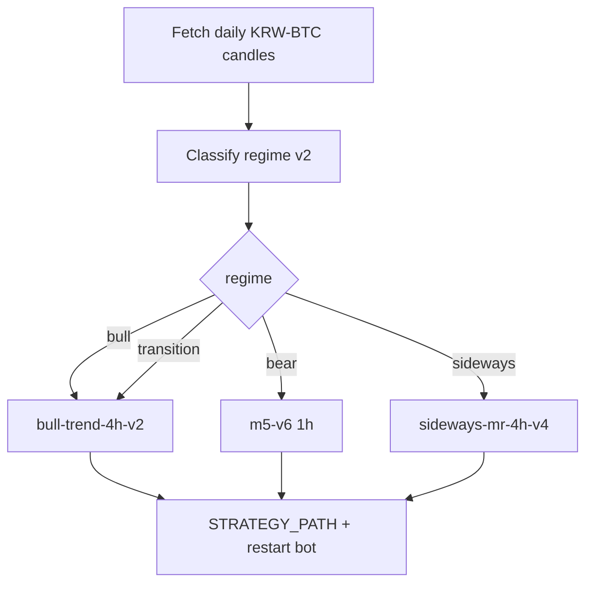
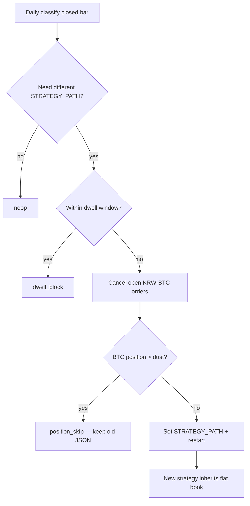

# Regime Auto-Switch Playbook (Bot / Agent)

> **Goal**: Keep the LIVE Docker bot on the strategy that matches the **current daily regime**.  
> **Why**: 5y sequential backtests **falsified always-on m5-v6**. Regime Policy C outperformed.  
> **Not**: investment advice. Switching files ≠ guaranteed profit.  
> **Sleeves**: This playbook is the **CORE** (Upbit) sleeve only. Scalp capital is separate — see [`dual-sleeve-allocation.md`](dual-sleeve-allocation.md) / `config/sleeves.json`.

| Field | Value |
|-------|-------|
| Updated | 2026-07-28 |
| Repo | `Mansejin/auto-trade` |
| Branch (work) | `cursor/sma-golden-cross-filtered-827b` |
| Bot host | `ubuntu@129.225.205.185` |
| Bot dir | `~/auto-trade` |
| Container | `upbit-paper-bot` |
| Compose service | usually `bot` |
| Env key | `STRATEGY_PATH=/app/strategies/<slug>.json` |
| Strategies mount | `./strategies` → `/app/strategies:ro` |

---

## 1. Policy map (MUST use these files)

| Regime | Local file | Slug (filename without `.json`) | TF |
|--------|------------|----------------------------------|-----|
| `bull` | `strategies/regime-bull-trend-4h-v2.json` | `regime-bull-trend-4h-v2` | 4h |
| `bear` | `strategies/krw-btc-1h-ema-adx23-rsi55-sl3-tp45-m5-v6.json` | `krw-btc-1h-ema-adx23-rsi55-sl3-tp45-m5-v6` | 1h |
| `sideways` | `strategies/regime-sideways-mr-4h-v5.json` | `regime-sideways-mr-4h-v5` | 4h |
| `transition` | `strategies/regime-bull-trend-4h-v2.json` | `regime-bull-trend-4h-v2` | 4h |

Pointer file after switch: `strategies/ACTIVE_STRATEGY` = `<slug>` (one line).



---

## 2. Regime rules (engine v2)

Compute on **closed daily** candles only (drop Upbit’s in-progress day bar; use `candles[-2]` / `closed_daily_candles`).

- `sideways` if `ADX14 < 20`
- `bull` if `ADX>=20` AND `close>SMA200` AND `SMA50>SMA200` AND `+DI >= -DI`
- `bear` if `ADX>=20` AND `close<SMA200` AND `SMA50<SMA200` AND `close<SMA50` AND `-DI > +DI`
- else `transition`

Policy C maps `transition` → bull strategy (intentional; do not remap without re-backtest).

Reference implementation: `scripts/regime_select.py`  
(prints JSON + writes `reports/regime-current.json`)

```bash
python3 scripts/regime_select.py
# read selected_file / regime
```

---

## 3. Switch procedure (remote bot)

### 3.1 Ensure JSON files exist on server mount

Copy at least these four into `~/auto-trade/strategies/`:

- `regime-bull-trend-4h-v2.json`
- `krw-btc-1h-ema-adx23-rsi55-sl3-tp45-m5-v6.json`
- `regime-sideways-mr-4h-v5.json`
- `ACTIVE_STRATEGY`

### 3.2 Apply switch

```bash
# on deploy machine / agent with SSH access
REGIME=$(python3 -c "import json;print(json.load(open('reports/regime-current.json'))['regime'])")
# or parse regime_select stdout

case "$REGIME" in
  bull|transition) SLUG=regime-bull-trend-4h-v2 ;;
  bear)            SLUG=krw-btc-1h-ema-adx23-rsi55-sl3-tp45-m5-v6 ;;
  sideways)        SLUG=regime-sideways-mr-4h-v5 ;;
  *) echo "unknown regime $REGIME"; exit 1 ;;
esac

echo "$SLUG" > strategies/ACTIVE_STRATEGY
scp strategies/${SLUG}.json strategies/ACTIVE_STRATEGY ubuntu@129.225.205.185:~/auto-trade/strategies/

ssh ubuntu@129.225.205.185 bash -s -- "$SLUG" <<'REMOTE'
set -euo pipefail
SLUG="$1"
cd ~/auto-trade
test -f "strategies/${SLUG}.json"
cp .env ".env.bak.regime.$(date +%Y%m%d_%H%M%S)"
sed -i "s|^STRATEGY_PATH=.*|STRATEGY_PATH=/app/strategies/${SLUG}.json|" .env
grep '^STRATEGY_PATH=' .env
docker compose up -d
docker compose restart bot
sleep 3
docker logs --tail 30 upbit-paper-bot
REMOTE
```

Helper (repo): `scripts/deploy-strategy-to-bot.sh <slug>`  
Preferred wrapper: `scripts/regime_switch_bot.sh` (classify → deploy).

### 3.3 Verify

Bot logs must show:

- `전략 파일  : /app/strategies/<slug>.json`
- timeframe matching the map (1h for bear, 4h for bull/sideways/transition)

---

## 4. Safety rules (do not skip)

1. **Only switch JSON + restart** — do not rebuild image unless required.  
2. **Do not invent new strategy rules** during a switch job. Do not add SMA buffers or change `transition` mapping without a new Policy backtest.  
3. Log every switch/skip: old slug, new slug, regime, action, timestamp → `logs/regime-switch.jsonl` and human lines in `logs/regime-switch.log`.  
4. **Hard dwell**: if last **`action=switched`** is &lt; **24h** (`MIN_DWELL_HOURS`), **block** the switch (`action=dwell_block`). Ignore noop/skip log noise. `FORCE=1` bypasses dwell only.  
5. **Position guard** (before `STRATEGY_PATH` change): cancel open `KRW-BTC` orders; if BTC balance+locked (or paper position) &gt; dust, **skip switch** (`action=position_skip`). **No auto market-sell.** `SKIP_POSITION_GUARD=1` emergency only.  
6. LIVE mode places **real orders**. Confirm `.env` mode intentionally. Load keys only from server `.env`.  
7. Monthly strategy *redesign* still goes through Audit Team (`scripts/strategy_audit.py`). Regime switch ≠ strategy redesign.

---

## 4.1 Position handoff (edge cases — defined)

Regime switch changes **which JSON the bot loads**. It does **not** invent a special exit for the old strategy’s bag.

| Situation | Defined behavior |
|-----------|------------------|
| Flat (no BTC above dust) + open orders | Cancel open `KRW-BTC` orders → allow `STRATEGY_PATH` change → restart bot |
| BTC position still open (LIVE wallet or paper `state.json`) | **`position_skip`** — keep current strategy file; retry next cron after flat |
| Switch allowed, then restart | Bot reloads new JSON; `data/state.json` portfolio is **reused** (not wiped). New strategy’s buy/sell/SL/TP apply to the tracked position going forward |
| LIVE sell path | Bot sells **tracked bot position qty** only (not “dump whole exchange wallet”) — see bot on `main` |
| Forced flatten | **Not automated.** Human may flatten manually, then let cron switch. Do not enable `SKIP_POSITION_GUARD` casually |



**Not defined / not supported:** mid-position “soft handoff” where bull entries keep old SL while bear logic runs, or automatic market stop on regime flip. Those would change PnL vs Policy C segment backtests and need a separate study.

---

## 4.2 Known risks & review cadence (not auto-fixed)

### A) Lag of daily SMA50/200 + ADX

These are **lagging** by design. Regime flips often trail the tape by days; that lag is part of Policy C’s cost, not a cron bug.

- **Measured (AE12):** risk-off switches show **7d median BTC MDD ≈ −5.45%**, worst ≈ **−15.5%** (`reports/improve/20260729-ae12-lag-mdd.md`). Treat as **material for sizing**, not a reason to add ad-hoc SMA buffers.
- **Accept:** “뒷북 전환” drawdowns can happen while still on the previous specialist.
- **Do not “fix” with** arbitrary SMA buffers or leading indicators unless a new Policy backtest beats the current chain **and** passes audit gates.

### B) Parameter / timeframe overfit (ADX 20, 1h vs 4h)

ADX&lt;20 sideways cut and per-regime TFs may be sample-fit to the last ~5y labels.

- **Before changing LIVE map or thresholds:** run `scripts/walk_forward_check.py` on the candidate JSON and `scripts/strategy_audit.py` vs baseline (`reports/review-state/audit-policy.json` gates G1–G8, including MDD).
- **Cadence:** at least when promoting a new regime JSON, and on a fixed calendar (e.g. monthly redesign window in the audit playbook) — not on every daily switch.
- Daily cron only **selects among already-audited files**; it must not retune ADX/TF.

### C) Ops vs research boundary

| Layer | Job |
|-------|-----|
| Daily `remote_regime_switch.py` | Closed-bar classify + dwell + cancel/skip + path swap |
| `walk_forward_check.py` / `strategy_audit.py` | Falsify overfit / MDD regression before promotion |
| Human | Capital size, whether lag MDD is personally tolerable, LIVE approve |
## 5. Cron suggestion (on bot server or CI agent)

Upbit daily candles close at **00:00 UTC**. Classification uses the **last closed** bar, so cron may run any time after that (existing `20 15 * * *` UTC is fine; `10 0 * * *` is also fine for fresher signals). Do **not** rely on cron alone to avoid forming-bar noise.

```cron
20 15 * * * cd ~/auto-trade && python3 scripts/remote_regime_switch.py >> logs/regime-switch.cron.log 2>&1
```

---

## 6. Current expected state (as of 2026-07-28)

If regime is still **bear** → bot must stay on:

`STRATEGY_PATH=/app/strategies/krw-btc-1h-ema-adx23-rsi55-sl3-tp45-m5-v6.json`

When it flips to bull/transition → switch to `regime-bull-trend-4h-v2.json` without waiting for a human redesign.

---

## 7. Paste-ready agent prompt

```text
You are wiring REGIME AUTO-SWITCH for the existing Upbit LIVE Docker bot.

Read and follow: docs/regime-auto-switch-playbook.md

Tasks:
1) Run `python3 scripts/regime_select.py` and report regime + selected_file.
2) Ensure these JSONs exist on the bot server `~/auto-trade/strategies/`:
   - regime-bull-trend-4h-v2.json
   - krw-btc-1h-ema-adx23-rsi55-sl3-tp45-m5-v6.json
   - regime-sideways-mr-4h-v5.json
3) Set STRATEGY_PATH to the mapped slug for the current regime and restart `upbit-paper-bot`.
4) Update strategies/ACTIVE_STRATEGY to that slug.
5) Append a switch log line (timestamp, regime, old→new path).
6) Verify docker logs show the correct strategy file + timeframe.
7) Do NOT redesign indicators. Do NOT skip safety rules in the playbook.
8) If SSH/key missing, stop and report exactly what is missing.

Success criteria:
- Bot STRATEGY_PATH matches Policy C map for current regime
- Container healthy
- Log evidence pasted in your final message
```

---

## 8. Related links in-repo

- 5y proof that always-v6 fails: `reports/five-year/README.md`
- Policy / review state: `reports/review-state/regime-engine.json`
- Audit gates (for redesign, not for daily switch): `docs/monthly-automation-prompt.md`


## 9. Production install status (2026-07-28)

Installed on bot server `ubuntu@129.225.205.185`:

- Script: `~/auto-trade/scripts/remote_regime_switch.py` (**ops guards**: closed bar, hard dwell, cancel-orders + position-skip)
- Wrapper: `~/auto-trade/scripts/run-regime-switch.sh`
- Cron (UTC): `20 15 * * *` → daily regime classify + STRATEGY_PATH switch if needed (forming bar is ignored in code)
- Log: `~/auto-trade/logs/regime-switch.jsonl`, `logs/regime-switch.log`, and `logs/regime-switch.cron.log`
- Desk snapshot: `~/auto-trade/logs/regime-current.json` (read by `upbit-desk` ticker “레짐”)
- Current: regime **bear** → already on `m5-v6` (noop verified)

Redeploy this branch’s `scripts/remote_regime_switch.py` to the server before relying on the new guards.

