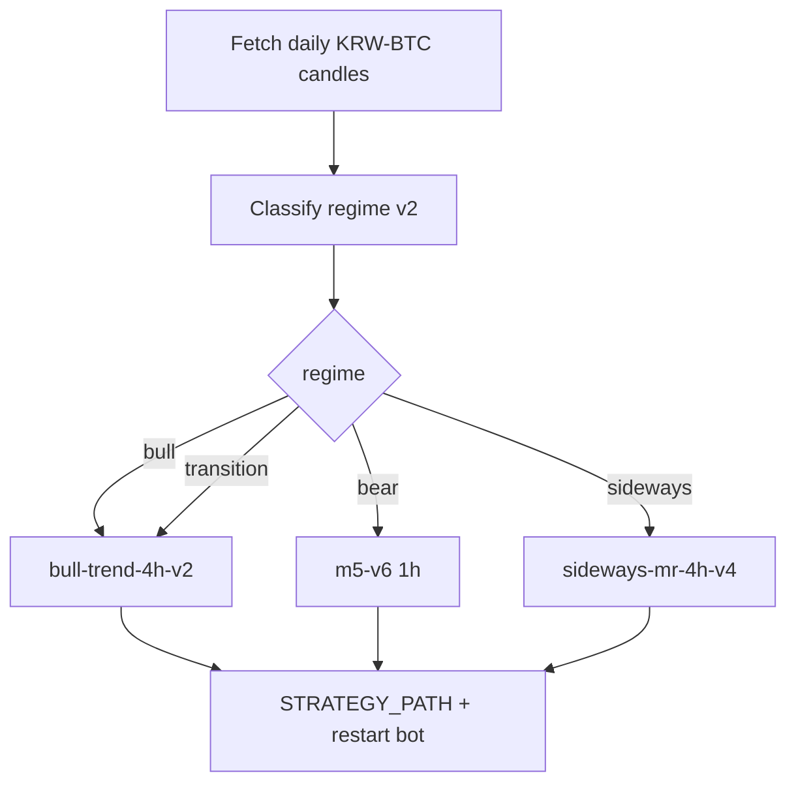

# Regime Auto-Switch Playbook (Bot / Agent)

> **Goal**: Keep the LIVE Docker bot on the strategy that matches the **current daily regime**.  
> **Why**: 5y sequential backtests **falsified always-on m5-v6**. Regime Policy C outperformed.  
> **Not**: investment advice. Switching files ≠ guaranteed profit.

| Field | Value |
|-------|-------|
| Updated | 2026-07-28 |
| Repo | `Mansejin/auto-trade` |
| Branch (work) | `cursor/sma-golden-cross-filtered-827b` |
| Bot host | `ubuntu@129.225.205.185` |
| Bot dir | `~/auto-trade` |
| Container | `upbit-paper-bot` |
| Compose service | usually `bot` |
| Env key | `STRATEGY_PATH=/app/strategies/<slug>.json` |
| Strategies mount | `./strategies` → `/app/strategies:ro` |

---

## 1. Policy map (MUST use these files)

| Regime | Local file | Slug (filename without `.json`) | TF |
|--------|------------|----------------------------------|-----|
| `bull` | `strategies/regime-bull-trend-4h-v2.json` | `regime-bull-trend-4h-v2` | 4h |
| `bear` | `strategies/krw-btc-1h-ema-adx23-rsi55-sl3-tp45-m5-v6.json` | `krw-btc-1h-ema-adx23-rsi55-sl3-tp45-m5-v6` | 1h |
| `sideways` | `strategies/regime-sideways-mr-4h-v5.json` | `regime-sideways-mr-4h-v5` | 4h |
| `transition` | `strategies/regime-bull-trend-4h-v2.json` | `regime-bull-trend-4h-v2` | 4h |

Pointer file after switch: `strategies/ACTIVE_STRATEGY` = `<slug>` (one line).



---

## 2. Regime rules (engine v2)

Compute on **daily** candles:

- `sideways` if `ADX14 < 20`
- `bull` if `ADX>=20` AND `close>SMA200` AND `SMA50>SMA200` AND `+DI >= -DI`
- `bear` if `ADX>=20` AND `close<SMA200` AND `SMA50<SMA200` AND `close<SMA50` AND `-DI > +DI`
- else `transition`

Reference implementation: `scripts/regime_select.py`  
(prints JSON + writes `reports/regime-current.json`)

```bash
python3 scripts/regime_select.py
# read selected_file / regime
```

---

## 3. Switch procedure (remote bot)

### 3.1 Ensure JSON files exist on server mount

Copy at least these four into `~/auto-trade/strategies/`:

- `regime-bull-trend-4h-v2.json`
- `krw-btc-1h-ema-adx23-rsi55-sl3-tp45-m5-v6.json`
- `regime-sideways-mr-4h-v5.json`
- `ACTIVE_STRATEGY`

### 3.2 Apply switch

```bash
# on deploy machine / agent with SSH access
REGIME=$(python3 -c "import json;print(json.load(open('reports/regime-current.json'))['regime'])")
# or parse regime_select stdout

case "$REGIME" in
  bull|transition) SLUG=regime-bull-trend-4h-v2 ;;
  bear)            SLUG=krw-btc-1h-ema-adx23-rsi55-sl3-tp45-m5-v6 ;;
  sideways)        SLUG=regime-sideways-mr-4h-v5 ;;
  *) echo "unknown regime $REGIME"; exit 1 ;;
esac

echo "$SLUG" > strategies/ACTIVE_STRATEGY
scp strategies/${SLUG}.json strategies/ACTIVE_STRATEGY ubuntu@129.225.205.185:~/auto-trade/strategies/

ssh ubuntu@129.225.205.185 bash -s -- "$SLUG" <<'REMOTE'
set -euo pipefail
SLUG="$1"
cd ~/auto-trade
test -f "strategies/${SLUG}.json"
cp .env ".env.bak.regime.$(date +%Y%m%d_%H%M%S)"
sed -i "s|^STRATEGY_PATH=.*|STRATEGY_PATH=/app/strategies/${SLUG}.json|" .env
grep '^STRATEGY_PATH=' .env
docker compose up -d
docker compose restart bot
sleep 3
docker logs --tail 30 upbit-paper-bot
REMOTE
```

Helper (repo): `scripts/deploy-strategy-to-bot.sh <slug>`  
Preferred wrapper: `scripts/regime_switch_bot.sh` (classify → deploy).

### 3.3 Verify

Bot logs must show:

- `전략 파일  : /app/strategies/<slug>.json`
- timeframe matching the map (1h for bear, 4h for bull/sideways/transition)

---

## 4. Safety rules (do not skip)

1. **Only switch JSON + restart** — do not rebuild image unless required.  
2. **Do not invent new strategy rules** during a switch job.  
3. Log every switch: old slug, new slug, regime, timestamp → `reports/regime-switch-log.jsonl` (append).  
4. Optional hysteresis: if last switch &lt; 24h ago AND regime flipped then flipped back, skip (prevent thrash). Recommended min dwell: **24h** or until daily bar confirms.  
5. LIVE mode places **real orders**. Confirm `.env` mode intentionally.  
6. Monthly strategy *redesign* still goes through Audit Team (`scripts/strategy_audit.py`). Regime switch ≠ strategy redesign.

---

## 5. Cron suggestion (on bot server or CI agent)

Run **once per day after daily candle is available** (e.g. 00:20 KST / 15:20 UTC previous day close settled — pick a stable time):

```cron
20 15 * * * cd /path/to/auto-trade && python3 scripts/regime_select.py && bash scripts/regime_switch_bot.sh >> logs/regime-switch.log 2>&1
```

---

## 6. Current expected state (as of 2026-07-28)

If regime is still **bear** → bot must stay on:

`STRATEGY_PATH=/app/strategies/krw-btc-1h-ema-adx23-rsi55-sl3-tp45-m5-v6.json`

When it flips to bull/transition → switch to `regime-bull-trend-4h-v2.json` without waiting for a human redesign.

---

## 7. Paste-ready agent prompt

```text
You are wiring REGIME AUTO-SWITCH for the existing Upbit LIVE Docker bot.

Read and follow: docs/regime-auto-switch-playbook.md

Tasks:
1) Run `python3 scripts/regime_select.py` and report regime + selected_file.
2) Ensure these JSONs exist on the bot server `~/auto-trade/strategies/`:
   - regime-bull-trend-4h-v2.json
   - krw-btc-1h-ema-adx23-rsi55-sl3-tp45-m5-v6.json
   - regime-sideways-mr-4h-v5.json
3) Set STRATEGY_PATH to the mapped slug for the current regime and restart `upbit-paper-bot`.
4) Update strategies/ACTIVE_STRATEGY to that slug.
5) Append a switch log line (timestamp, regime, old→new path).
6) Verify docker logs show the correct strategy file + timeframe.
7) Do NOT redesign indicators. Do NOT skip safety rules in the playbook.
8) If SSH/key missing, stop and report exactly what is missing.

Success criteria:
- Bot STRATEGY_PATH matches Policy C map for current regime
- Container healthy
- Log evidence pasted in your final message
```

---

## 8. Related links in-repo

- 5y proof that always-v6 fails: `reports/five-year/README.md`
- Policy / review state: `reports/review-state/regime-engine.json`
- Audit gates (for redesign, not for daily switch): `docs/monthly-automation-prompt.md`


## 9. Production install status (2026-07-28)

Installed on bot server `ubuntu@129.225.205.185`:

- Script: `~/auto-trade/scripts/remote_regime_switch.py`
- Wrapper: `~/auto-trade/scripts/run-regime-switch.sh`
- Cron (UTC): `20 15 * * *` → daily regime classify + STRATEGY_PATH switch if needed
- Log: `~/auto-trade/logs/regime-switch.jsonl` and `logs/regime-switch.cron.log`
- Current: regime **bear** → already on `m5-v6` (noop verified)

