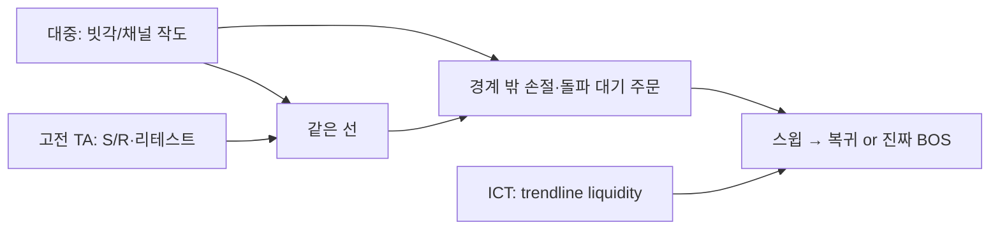

# 빗각 — 커뮤니티·대중 심리 종합 (저품질→고품질)

> **목적**: 디시·블라인드·블로그·프리미엄·ICT까지 **품질을 가리지 않고** 모아서, “대중이 빗각을 어떻게 소비·오해·모방하는지”를 본다.  
> **이유**: 차트 엣지는 종종 **공유된 작도 습관**에서 온다. 저품질 글도 유동성·함정 설계의 재료다.  
> **한계**: 유료 스터디/방송 원문 복제 없음. 2차 공개물 + 커뮤니티 발언 중심.  
> **관련**: [`trendline-parallel-channel-literature.md`](trendline-parallel-channel-literature.md) · [`inbum-diagonal-channel-playbook.md`](../inbum-diagonal-channel-playbook.md)

| Field | Value |
|-------|-------|
| Updated | 2026-07-29 |
| Scope | KR 커뮤니티 + 영문 ICT/SMC 접점 |
| Bias note | 인범·BGSC·레퍼럴 논쟁은 **기법 본문과 분리**해 기록 |

---

## 0. 한 줄 종합

**빗각 = (대부분) 추세선·평행채널의 인플루언서 브랜드명.**  
대중은 (1) “선만 잘 그으면 된다” vs (2) “지맘대로 선” vs (3) “기다림·손절이 본체”로 갈라지고,  
ICT/SMC는 같은 선을 **지지가 아니라 스탑이 몰린 대각 유동성**으로 읽는다.  
세 층이 겹치는 자리가 실전에서 반응할 확률이 높다.



---

## 1. 품질 티어 맵 (수집분)

등급은 **정보량·일관성·검증가능성** 기준. 수익성 보증 아님.

### Tier D — 저품질 / 밈·냉소 (심리 재료로는 중요)

| 출처 | 요지 | URL |
|------|------|-----|
| Blind «인범티비» | “좆대로 선긋고 빗각이라고 부르는 거”; “다 연결해보고 맘에 드는 게 너의 빗각”; “빗각은 기다림인데 대부분 못 기다려”; “결국 보조지표, 손절이 실력”; 인범이 디시에 ‘50%는 여기서 배웠다’고 썼다는 **2차 진술** | https://www.teamblind.com/kr/post/인범티비-0YB6kGHM |
| Blind «인범TV» | 툴 질문 → 피치포크? / **TV Fib Channel**(1–4 끄고) 혼동 | https://www.teamblind.com/kr/post/형들-유투버-인범TV-n0pvqjux |
| Blind 기타 | “지맘대로 빗각그으면 다되나 / 어휴 그놈의 빗각” | teamblind 스레드들 |
| DC 비갤 | 빗각 기법보다 **레퍼럴·수수료 환급** 논쟁이 주류 | 예: https://gall.dcinside.com/board/view/?id=bitcoins_new1&no=7040428 |
| DC 해외선물 미니갤 | 인범 본인 뷰 공유 글 존재(기법 상세보다 시황) | 예: https://gall.dcinside.com/mini/board/view/?id=kuya&no=16381 |

**대중 심리 추출**

- 빗각 = **주관적 작도**라는 냉소가 이미 공유됨 → “선 = 성배” 기대와 “선 = 개소리” 냉소가 공존.
- 따라하는 사람의 실패 이유로 가장 자주 나오는 건 **기다림/손절**이지 각도 공식이 아님.
- 도구 혼동(피치포크·Fib Channel·평행채널) → 커뮤니티가 **같은 이름을 다른 기하**에 붙임.

### Tier C — 중저품질 (팬·정리·홍보 섞임)

| 출처 | 요지 | URL |
|------|------|-----|
| Steemit @banguri | “**오직 빗각 하나로만** 트레이딩”; 해선→코인; 매일 방송 추천 | https://steemit.com/kr/@banguri/2025-1-3-25-4 |
| Steemit 후속 | “빗각으로 진입·손절 타이밍은 예술” + BGSC/DEX 홍보 병기 | https://steemit.com/kr/@banguri/2025-10-7-47 |
| 자본주의빌런 | 디시 일화로 접함; **빗각 ≈ 추세선+채널**; 앤트톡 스터디=코인 소각 게이트 | https://cap-villian.tistory.com/972 |
| 개미톡/벅스코인 정리글 | 생태계·모의투자·스터디 비용(BGSC 소각) — 기법보다 비즈니스 | lifeinvestvista / easymoney100 / 스포츠경향 보도 |
| Steemit @futurecurrency | 레퍼럴 규모 감탄; 기법 설명 약함 | steemit zzan 포스트 |

**대중 심리 추출**

- “하나만 쓴다” 서사가 **단순함 미학**으로 팔림 → 추종자 차트에 선이 많아질수록 아이러니.
- 기법 학습 경로가 **유료/코인 소각 스터디**와 묶여 공개 스펙이 얇아짐.
- 실력 인정과 코인·레퍼럴 서사가 **한 인물에 뭉쳐** 기법 평가가 오염되기 쉬움.

### Tier B — 중품질 (실전 정리·작도 가이드, 출처 편차)

| 출처 | 요지 | URL |
|------|------|-----|
| 투진사 프리미엄 | “그놈의 빗각”=추세선; **고고저/저저고**; Fib Channel 1:1; 주→일→4h; 좁은 TF 선 난사 금지; vol 터진 자리=매물 | https://contents.premium.naver.com/tujunsa/bitcoin/contents/250901120032929yh |
| brunch @urbantrader | 빗각≡추세선 100%; **돌파+리테스트** 선호; 보수 작도; 나스닥>코인 명확성 | https://brunch.co.kr/@urbantrader/56 , `/62` |
| 바다샤크 프리미엄 | “빗각이라 부르는 선”도 추세선; 평행채널=치트키 인식 후 현실화 | https://contents.premium.naver.com/badashark/nasdaq/contents/250317072153336dk |
| stockstudy 프리미엄 | 역사적 지점 연결 **빗각(추세)** 복사로 채널 구성 (지수 주봉) | https://contents.premium.naver.com/stockstudy/stockstudy1/contents/250407164550873pj |
| 코인니스 오피니언 | “장기 빗각” + **유동성 밀집 박스** 교차; 이탈 시 시나리오 분기 | https://coinness.com/community/opinion/9863 |
| 시그비트 등 | 3-touch 패러럴, 리테스트, vol (고전 채널 룰의 한글 판) | sigbtc.pro 교육글 |
| lowestprice 티스토리 | “빗각 분석”=**각도/강도** 해석; 단독 위험, 다중지표·멀티TF 권고 (인범과 무관한 일반론) | https://lowestprice.tistory.com/entry/... |
| developerhs 등 | 교과서식 추세선·채널 매수/매도 (입문) | tistory 가이드들 |

**대중 심리 추출**

- 한글권에서 ‘빗각’ 단어가 **인범 팬덤 밖**으로 번져 “기울어진 추세선” 일반명사화.
- 고품질 정리일수록 **작도 절제·상위 TF·리테스트·거래량**으로 수렴 (고전 TA와 동일).
- 코인니스류는 이미 **빗각 ∩ 유동성 구간**을 말함 → ICT 언어와 자연 접합.

### Tier A — 고품질 / 고전·프레임워크 (브랜드 무관)

| 출처 | 요지 | URL |
|------|------|-----|
| Edwards & Magee / StockCharts / Murphy | 추세선·채널·touch·penetration·throwback | literature 노트 §2.1 |
| Investopedia Channeling | 내부 bounce + 돌파 | 동상 |
| ICT / SMC (영문) | **Trendline liquidity**: 선은 지지가 아니라 스탑 리본; sweep → reclaim vs real BOS | 아래 §3 |

---

## 2. 커뮤니티가 말하는 “빗각의 본체” (합의 vs 분열)

### 합의에 가까운 것

| # | 진술 | 누가 |
|---|------|------|
| 1 | 빗각 ≈ 추세선(+채널) | urbantrader, 투진사, 자본주의빌런, 바다샤크 |
| 2 | 의미 있는 고·저를 잇는다 (고고저/저저고) | 투진사, 다수 작도글 |
| 3 | 상위 TF가 더 신뢰 | 투진사, 입문 가이드 |
| 4 | 선 난사하면 망한다 | 투진사, Blind 냉소와 동형 |
| 5 | 엣지는 선보다 **대기·손절·리테스트** | Blind, urbantrader, Steemit 시청자 |

### 분열 / 혼동

| 주제 | A설 | B설 |
|------|-----|-----|
| 도구 | 평행 Trend/Channel | Fib Channel 1:1 / Pitchfork |
| 진입 | 터치 반등 | 돌파 후 리테스트만 |
| 보조지표 | 빗각만 (시청자 관찰) | vol·이평·RSI 병행 필수 |
| 각도 | “각”이 브랜드의 핵심 | 각도는 강도 힌트일 뿐 (일반 빗각론) |
| 학습 | 방송 보고 감각 | 스터디(코인 소각)로 정식화 |

**연구 함의**: 자동화가 “인범 빗각”을 목표로 하면 **도구 집합이 하나로 고정되지 않음**.  
검증 단위는 브랜드가 아니라 **기하 타입**(parallel / fib-channel / pitchfork)별로 쪼개야 함.

---

## 3. ICT / SMC와의 접점 (의도적으로 끌어옴)

ICT는 빗각을 쓰지 않지만, **같은 대중 선을 다른 언어로 사냥**한다.

### 3.1 Trendline liquidity (핵심)

출처 요약: [LiquidityScan — Trendline Liquidity](https://liquidityscan.io/blog/what-is-trendline-liquidity-and-why-it-gets-swept), BWT ICT Liquidity, ictkillzone 등.

- 상승 추세선 아래 = **Sell-side liquidity (SSL)** 리본  
  (롱 손절 + 이탈 숏 대기)
- 하락 추세선 위 = **Buy-side liquidity (BSL)** 리본
- 선이 **눈에 잘 띄고 터치가 많을수록** 스탑이 더 쌓임 → “예쁜 빗각”일수록 스윕 타깃
- ICT 주장: 대각선에 **물리적 지지력은 없고**, 있는 건 **믿음이 만든 주문**뿐

### 3.2 고전 채널 vs ICT 번역표

| 고전 / 빗각 커뮤니티 | ICT / SMC |
|----------------------|-----------|
| 채널 하단 지지 터치 | SSL 근처; 진짜 지지일 수도, 스윕 직전일 수도 |
| 하단 종가 이탈 | SSL sweep **또는** real BOS/CHoCH |
| 가돌파 후 복귀 | Sweep + reclaim |
| 돌파 후 리테스트 | Broken level → 역할 전환; ICT는 종종 **OB/FVG(돌파 기원)** 리테스트를 선호 |
| 채널 폭 measured move | Draw on liquidity / 다음 EQH·EQL·세션 H/L |
| 거래량 동반 돌파 | Displacement (+ FVG)에 가까움 |
| 맥점 (빗각∩수평∩매물) | Confluence / stacked liquidity |

### 3.3 우리 표본과의 연결 (Batch 1)

- **S19** (리테스트+고vol인데 실패): ICT식으로 읽으면 “리테스트”가 아니라 **반대 유동성 흡수 후 반대 방향**일 수 있음 → 거절/MSS 없는 리테스트 진입 금지와 일치.
- **S04→S05** (약한 돌파 vol + 강한 리테스트 vol): 스윕·재가속 서사와 닮음.
- **S27** (하단 이탈 후 즉시 복귀): classic fakeout = ICT sweep candidate.
- Mode A 연속 터치 후 붕괴: “터치 많을수록 권위↑” 고전 vs “터치 많을수록 유동성↑→스윕↑” ICT — **둘 다 맞을 수 있음(국면 의존)**.

### 3.4 연구에 넣을 ICT 체크 (코딩 전 관찰용)

수동 로그에 선택 컬럼 후보:

```
ict_read: hold | sweep_reclaim | real_break | unclear
sweep_wick_beyond: y/n
reclaim_within_bars: int
fvg_after_displace: y/n/na
confluence_horizontal: y/n
```

목적은 ICT 신봉이 아니라 **같은 사건에서 고전 라벨과 ICT 라벨이 언제 갈리는지** 보는 것.

---

## 4. 대중 심리 모델 (작업용)

```
1) 방송/커뮤니티가 “예쁜 빗각”을 반복 노출
2) 추종자가 동일·유사 앵커에 선을 긋고
   - 터치에 진입 / 이탈에 손절 / 돌파에 추격
3) 주문이 경계 바깥에 군집
4) 단기적으로 선이 “먹히는” 자기실현 ↔ 스윕으로 “배신”되는 구간이 교차
5) 실패자는 “선이 틀렸다”고 말하고
   숙련 서술(Blind/urbantrader)은 “기다림·손절·리테스트”를 말함
```

→ **알파 가설 후보**는 “선 공식”이 아니라:

1. **많이 보이는 선**에서의 스윕·복귀 (ICT)  
2. **종가+vol 확정 돌파 후 리테스트** (고전 B)  
3. **상위 TF 소수 선 × 하위 수평/세션** (투진사)  
4. **거절 없는 리테스트는 패스** (Batch1 S19)

---

## 5. 인물·생태계 노트 (기법과 분리)

| 항목 | 커뮤니티 서술 |
|------|----------------|
| 인물 | 조인범 / 인범TV — 리니지 BJ → 해선 → 코인 |
| 기법 브랜드 | 빗각 |
| 플랫폼 | 개미톡(앤트톡) 모의투자, BGSC, 스터디(소각) |
| 논쟁 | 레퍼럴 100% 환급 서사, 코인 펌핑 의심, “강의 극혐” 이미지 vs 스터디 유료화 |
| 디시 | 기법 토론 < 수수료·레퍼럴·시황 비중 큼 |

기법 연구 시 **BGSC·레퍼럴 ROI와 채널 edge를 한 가설로 묶지 말 것.**

---

## 6. 수집 백로그 (계속 쌓기)

- [ ] DC 해외선물갤/비트갤에서 “빗각” 키워드 추가 스레드 (작도 캡처 있는 것만)
- [ ] 유튜브 인범 클립 공개 구간 — 앵커·세션·손절 발화만 타임스탬프 노트
- [ ] 개미톡 공개 게시판에 빗각 작도 예시가 있으면 링크만
- [ ] 영문 “Andrews pitchfork vs parallel channel” 혼동 사례
- [ ] Batch2 CSV에 `ict_read` 컬럼 파일럿 10건

---

## 7. 다음 연구 액션 (코딩 아님)

1. Batch1 clearest 3건(S15–16, S10–11, S19)에 **ICT 라벨** 병기.  
2. parallel vs Fib Channel vs pitchfork — 커뮤니티 혼동을 **별 가설**로 분리.  
3. Mode B 규칙 카드에 “거절 캔들/MSS” 한 줄 추가 검토 (S19).  
4. 고전 발췌와 ICT trendline-liquidity 문단을 literature 게이트에 묶기.

---

## Appendix — 빠른 인용 (커뮤니티)

> “좆대로 선긋고 빗 각 이라고 부루눈거에요” / “다연결해보고 맘에 드는거 골라 그게 너의 빗각이다” / “인범 빗각은 기다림인데 대부분 그거보고 못기다려”  
> — Blind «인범티비»

> “사실 '빗각'이라는 단어는 '추세선'을 다르게 표현한 것일 뿐”  
> — brunch @urbantrader/56

> “여러 분석 기법을 사용 하는 것이 아니라 오직 빗각 하나로만”  
> — Steemit @banguri

> “내가 봤을때는 그냥 추세선 + 채널 정도로 보이고”  
> — 자본주의빌런

> “A multi-touch ascending trendline is the same structure [as equal lows] tilted.”  
> — LiquidityScan, Trendline Liquidity
