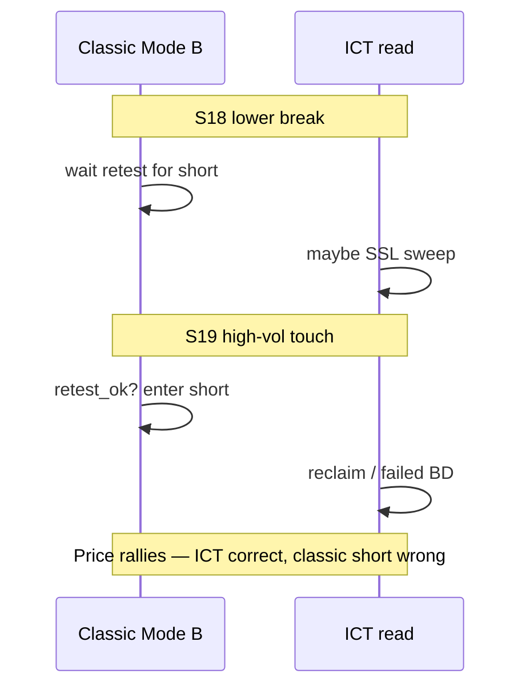

# Clearest 3 — ICT 병기 (Batch1)

> S15→S16 · S10→S11 · S18→S19(실패 교훈).  
> 고전 라벨은 CSV 원본 유지. 여기가 **ICT 재해석**.

| Field | Value |
|-------|-------|
| Updated | 2026-07-29 |
| Log | [`channel-manual-sample-log.csv`](channel-manual-sample-log.csv) |
| Classic | Edwards–Magee throwback / Murphy vol+confirm |
| ICT | trendline liquidity, sweep vs BOS |

---

## 공통 필드

| Field | Meaning |
|-------|---------|
| `ict_read` | `real_break` \| `sweep_reclaim` \| `hold` \| `failed_breakdown` \| `unclear` |
| `sweep_wick` | 경계 **너머 윅** 후 몸통 복귀 여부 |
| `classic_ok_entry` | 당시 규칙으로 진입해도 됐는지 (사후) |
| `murphy_check` | 종가+vol+확인(거절) 통과? |

---

## Pair A — S15 → S16 (베스트 Mode B)

| id | classic | ict_read | sweep_wick | murphy_check | note |
|----|---------|----------|------------|--------------|------|
| S15 | B_break upper, volx **1.80**, close out | **real_break** | n (body close held out) | break OK as **heads-up** | Asc channel upper break; displacement-ish on 4H |
| S16 | B_retest_ok, volx 0.54, ran to 747 | **hold** (mitigation/throwback) | n | **entry OK** — held above broken rail + follow-through | Textbook **throwback**; low-vol retest then extend |

**종합**: 고전 Mode B와 ICT(이탈 유지→기원 레일 재방문)가 **일치**.  
Murphy: break+vol → wait; retest hold = confirm.  
Edwards: throwback after penetration.

---

## Pair B — S10 → S11 (가속 돌파, MM 미스)

| id | classic | ict_read | sweep_wick | murphy_check | note |
|----|---------|----------|------------|--------------|------|
| S10 | B_break upper, volx **2.22**, many prior upper tags | **real_break** (acceleration / BOS through channel BSL) | n | heads-up OK | Multi-touch upper = crowded; break with vol = continuation not sweep |
| S11 | B_retest_ok, volx 1.04; MM target miss (~764 vs top ~749) | **hold** then stall | n | entry **marginal** — hold ok, target greedy | Throwback held; 1×width TP too optimistic (S11 lesson) |

**종합**: 진입 논리는 맞음. ICT로도 “스윕 후 숏”이 아니라 **상방 BOS 후 리테스트 롱**.  
차이점: measured move 맹신은 Edwards/Murphy도 “채널 전술”이지 보장 아님.

**긴장점**: 다중 터치 후 돌파 — 고전=권위↑ 돌파, ICT=유동성 소진 후 가속. 이번 건 **가속 쪽**.

---

## Pair C — S18 → S19 (실패: 거절 없는 리테스트)

| id | classic | ict_read | sweep_wick | murphy_check | note |
|----|---------|----------|------------|--------------|------|
| S18 | B_break lower, volx **2.77** | **unclear→possible SSL raid** | partial (tight channel) | break heads-up only | Tight desc lower break looked “clean” |
| S19 | labeled B_retest_ok, volx **5.04**, then **rally to 746** | **sweep_reclaim / failed_breakdown** | y-ish (reclaim up) | **FAIL entry** — no bearish rejection | High vol at “retest” was fuel for **opposite** side |

**종합**: CSV의 `B_retest_ok`는 **구조적 재방문**만 맞고, **숏 시그널은 아님**.  
ICT: 하단 이탈이 SSL 스윕이었고, 고vol “리테스트”가 리클레임.  
Murphy: break ≠ signal; volume without rejection ≠ short.  
→ Mode B 카드에 **거절 필수** 고정.

---

## 점수판

| Pair | Classic Mode B entry | ICT agrees? | Takeaway |
|------|----------------------|-------------|----------|
| A S15–16 | Yes (after S16) | Yes | Keep as gold standard |
| B S10–11 | Yes (after S11) | Yes | Cap TP; multi-touch ≠ fade |
| C S18–19 | No (would lose) | Explains fail | Rejection filter mandatory |

---

## CSV 컬럼 추가

`channel-manual-sample-log.csv`에 아래 열을 추가하고, 위 5행(+S18)만 채움. 나머지 `na`.

- `ict_read`
- `sweep_wick`
- `murphy_confirm`
- `ict_notes`
