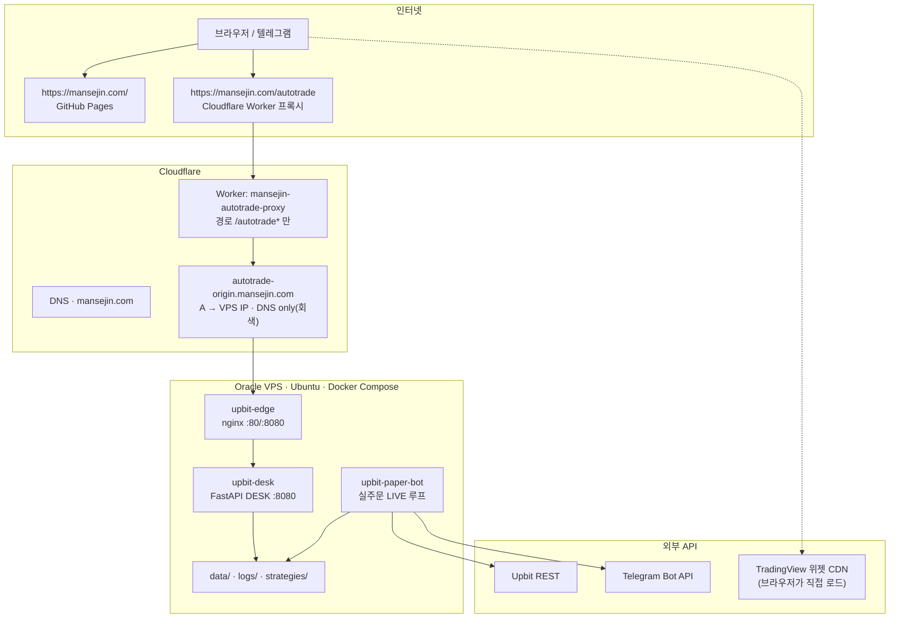

# 자동매매 서버 · 홈페이지 운영 구조와 과금 점검

작성 기준: 2026-07-29 (Oracle VPS `129.225.205.185`, 도메인 `mansejin.com`)

이 문서는 **지금 실제로 돌아가는 구성**과 **돈/한도 걱정이 있는지**를 한곳에 정리한 것입니다.

---

## 1. 한눈에 보기



| 주소 | 실제 서빙 | 역할 |
|------|-----------|------|
| `https://mansejin.com/` | GitHub Pages (+ Cloudflare) | 개인/브랜드 홈 |
| `https://mansejin.com/autotrade` | Worker → Oracle DESK | 봇 대시보드(로그인 필요) |
| `http://autotrade-origin.mansejin.com` | VPS nginx(edge) | Worker 전용 오리진(회색 구름) |
| `http://VPS_IP:80` | 동일 edge | 직접 접근 가능(보안상 토큰 필수) |

홈(`/`)과 대시보드(`/autotrade`)는 **서로 다른 오리진**입니다. Worker가 `/autotrade*`만 Oracle로 넘기고, 나머지 경로는 기존처럼 Pages가 담당합니다.

---

## 2. Oracle VPS 안에서 도는 것

`~/auto-trade`에서 `docker compose`로 3개 컨테이너가 상시 실행됩니다.

| 컨테이너 | 이미지/역할 | 리소스 한도 | 현재 대략 사용 |
|----------|-------------|-------------|----------------|
| `upbit-paper-bot` | 전략 평가·주문·상태 기록·텔레그램 | CPU 0.5 / RAM 256MB | ~27MB |
| `upbit-desk` | 로그인·상태 API·정적 UI | CPU 0.25 / RAM 128MB | ~40MB |
| `upbit-edge` | nginx → desk 프록시, 호스트 80/8080 공개 | CPU 0.1 / RAM 64MB | ~4MB |

호스트 메모리 약 **1GB**, 디스크 여유 충분(~40GB). Compose `mem_limit`으로 컨테이너가 폭주해도 호스트를 쉽게 삼키지 않게 막아 둔 상태입니다.

### 2.1 봇 (`upbit-paper-bot`)

현재 서버 `.env` 요약(비밀값 제외):

| 항목 | 값 | 의미 |
|------|-----|------|
| `PAPER` | `false` | **실주문(LIVE)** |
| `STRATEGY_PATH` | `…/krw-btc-1h-ema-adx23-rsi55-sl3-tp45-m5-v6.json` | BTC 1h 전략 |
| `POLL_SECONDS` | `300` | 5분마다 틱 |
| `ORDER_FRACTION` | `1.0` | 가용 KRW의 전액 비중으로 매수 시도 |
| `MAX_ORDER_KRW` | `15000` | 1회 매수 상한 1.5만 원 |
| `FEE_RATE` | `0.0005` | 수수료 가정 |

루프 요약:

1. 전략 JSON 로드 → Upbit 캔들 조회 → 지표·조건 평가  
2. 시그널(hold/buy/sell/SL/TP)에 따라 PAPER면 가상체결, LIVE면 Upbit 주문  
3. `logs/status.json`, `logs/latest_status.txt`, `data/state.json`, `data/risk.json` 갱신  
4. (설정 시) 텔레그램 알림·명령 응답  

대시보드는 이 파일들을 **읽기 전용**으로 보여 줍니다. DESK가 주문을 넣지는 않습니다.

### 2.2 DESK (`upbit-desk`)

- FastAPI + 정적 HTML/CSS/JS  
- `BASE_PATH=/autotrade` → 경로 접두사 `/autotrade`  
- 쿠키 기반 로그인(`DASHBOARD_TOKEN` = 대시보드 비밀번호)  
- `GET /autotrade/api/status` → 봇이 쓴 상태 JSON을 묶어 반환  
- 프론트는 약 20초마다 상태 폴링, TradingView 위젯은 **브라우저 → TradingView CDN** (서버 경유 아님)

### 2.3 edge (`upbit-edge`)

- 호스트 `80`, `8080` → 컨테이너 nginx → `desk:8080`  
- OCI Security List에 **TCP 80** 인바운드 허용 필요 (이미 열림)  
- Cloudflare Worker는 이 80 포트로만 붙음

---

## 3. 홈페이지·도메인 트래픽 경로

### 3.1 일반 홈 (`/`)

```
사용자 → Cloudflare(프록시) → GitHub Pages
```

`/autotrade`와 무관. Pages/CF 무료 플랜 범위의 정적 사이트.

### 3.2 대시보드 (`/autotrade`)

```
사용자
  → https://mansejin.com/autotrade*
  → Cloudflare Worker (mansejin-autotrade-proxy)
  → http://autotrade-origin.mansejin.com  (DNS only A 레코드 → VPS)
  → nginx edge :80
  → desk :8080
```

포인트:

- Worker는 **bare IP / :8080 직접 fetch가 불안정**해서, 호스트명 오리진 + :80 구성을 씀  
- `autotrade-origin`은 **회색 구름(DNS only)** 유지. 주황(프록시)으로 바꾸면 루프/522 위험이 큼  
- 로그인·쿠키 `path`는 `/autotrade`에 맞춤  

### 3.3 cloudflared quick tunnel

예전 임시 우회용 quick tunnel은 **정리 완료**(종료). 현재 경로만 사용: Worker → `autotrade-origin` → VPS `:80`.

---

## 4. 데이터·비밀이 어디에 있나

| 위치 | 내용 |
|------|------|
| VPS `~/auto-trade/.env` | Upbit 키, 텔레그램, `DASHBOARD_TOKEN`, LIVE 플래그 등 |
| `data/state.json` | 잔고·포지션·체결 이력 |
| `data/risk.json` | 킬스위치/일손실 등 리스크 상태 |
| `logs/status.json` | DESK가 읽는 최신 봇 스냅샷 |
| Cloudflare | 도메인 DNS, Worker 코드, (별도) API 토큰 |
| 로컬 PC | 개발용 클론; 실키는 VPS `.env`가 기준 |

대시보드 비밀번호는 Upbit API 키가 아니라 **DESK 전용 토큰**입니다.

---

## 5. 과금·한도 우려가 있는가?

결론부터: **인프라 구독료로 갑자기 큰 청구가 날 구성은 아님.**  
진짜 비용/리스크는 **LIVE 실주문 자본·수수료** 쪽입니다.

### 5.1 대체로 무료 / Always Free 쪽으로 보는 항목

| 서비스 | 현재 용도 | 과금 우려 |
|--------|-----------|-----------|
| **Oracle Cloud VPS** | 봇+DESK 상시 | Always Free(Ampere 등)면 인스턴스 요금 0에 가깝지만, **유료 shape/초과 리소스**면 과금. 콘솔 Usage에서 Free tier 여부 확인 권장. 아웃바운드 트래픽 한도 초과 시 과금/차단 가능(개인 DESK·5분 폴링·텔레그램 수준이면 보통 여유). |
| **Cloudflare DNS** | `mansejin.com` | Free 플랜이면 DNS·프록시 기본 무료 |
| **Cloudflare Worker** | `/autotrade` 프록시만 | **Workers Free (확인됨, $0)**. 하루 10만 요청·요청당 CPU 10ms. 개인 사용량(대시보드 기준 수십~수백 req/일대)이면 여유. 한도 초과 시 과금이 아니라 차단(1027). Paid($5/월+)로 Upgrade하지 않는 한 청구 없음 |
| **GitHub Pages** | 홈 `/` | 개인 정적 사이트 수준이면 무료 |
| **TradingView 위젯** | 차트 UI | 브라우저가 TV 공개 위젯 로드. VPS/CF 대역폭과 무관. (TV 이용약관·차단은 별개 이슈) |
| **Telegram Bot** | 알림/명령 | 무료 |
| **Upbit API** | 시세·주문 | API 자체 구독료 없음. **거래 수수료·슬리피지**는 발생 |

### 5.2 주의할 점 (돈/한도)

1. **실주문 자본**  
   `PAPER=false`, `MAX_ORDER_KRW=15000`, `ORDER_FRACTION=1.0`.  
   인프라비가 아니라 **최대 약 1.5만 원/회 규모의 실매수**가 나가는 구조. 잔고가 작아도 LIVE면 손실·수수료는 실제.

2. **Oracle가 Free가 아닌 경우**  
   Always Free가 아니거나 OCPU/메모리/부트볼륨이 Free 한도를 넘으면 매월 청구.  
   → OCI Billing / Free Tier usage를 한 번 확인.

3. **Cloudflare Workers Paid 실수 업그레이드**  
   대시보드에서 Paid로 올리면 최소 요금이 생길 수 있음. 지금 트래픽이면 Free로 충분.

4. **공개 포트 80**  
   과금이라기보다 **스캔/봇 트래픽**이 Worker·nginx 로그를 늘릴 수 있음. DESK는 토큰 없으면 본문 차단. 원하면 Cloudflare에서 오리진을 CF IP만 허용하는 식으로 더 조일 수 있음(추가 작업).

5. **cloudflared quick tunnel**  
   trycloudflare 임시 터널은 보통 과금 대상 아님. 다만 불필요 프로세스로 남겨 두면 헷갈리니 정리 권장.

6. **채팅/문서에 노출된 키**  
   Cloudflare API 토큰·예전 대시보드 토큰 등은 **재발급(rotate)** 하는 편이 안전. 과금보다 보안 이슈.

### 5.3 개인 사용량 감각 (Worker)

대략:

- 페이지 1회 오픈 ≈ HTML+CSS+JS+폰트+API 몇 회  
- 이후 20초마다 `api/status` 1회  

하루 종일 탭을 켜 둬도 **수천~만 요청대**가 일반적이고, Free 10만/일과 비교하면 여유입니다.  
불특정 다수에게 URL을 공개·홍보하면 Worker 한도에 더 빨리 닿을 수 있습니다.

---

## 6. 장애 시 어디를 보면 되나

| 증상 | 의심 지점 |
|------|-----------|
| 홈(`/`)만 깨짐 | GitHub Pages / CF 캐시 |
| `/autotrade`만 522 | OCI 80 차단, edge 다운, Worker ORIGIN DNS |
| `/autotrade` 로그인 후 상태 안 뜸 | desk 컨테이너, `logs/status.json` mtime, 봇 healthy |
| 주문 안 나감 | 봇 LIVE 설정, 리스크 킬스위치, Upbit 키·잔고 |
| 텔레그램 무응답 | `TELEGRAM_*`, 봇 프로세스 |

로컬에서 빠른 확인:

```bash
curl -sS http://127.0.0.1/autotrade/healthz
curl -sS https://mansejin.com/autotrade/healthz
docker compose -f ~/auto-trade/docker-compose.yml ps
```

---

## 차트 · 체결 마커 (TradingView)

DESK는 공개 **TradingView Advanced Chart 위젯**(`tv.js`)을 사용합니다.

| 방식 | 가능? | 비고 |
|------|--------|------|
| 무료 임베드 위젯에 봇 매수/매도 마커 주입 | ❌ | 외부 API 없음. iframe이라 좌표 오버레이도 불가 |
| **Charting Library** (`getMarks` / `createShape`) | ✅ | TradingView와 **라이선스 계약** 필요. datafeed에 체결 marks 공급 |
| 하단 **최근 체결** 리스트 | ✅ | 현재 방식. 차트와 분리 표시 |

차트 위 업비트형 ▲/▼를 쓰려면 Charting Library 도입이 필요하고, 무료 위젯만으로는 불가합니다.

---

## 7. 요약

- **홈**: Cloudflare + GitHub Pages  
- **대시보드**: Cloudflare Worker → DNS-only 오리진 → Oracle nginx → DESK  
- **매매**: 같은 VPS의 LIVE 봇이 5분마다 Upbit와 통신, 상태는 파일로 DESK에 공유  
- **인프라 과금**: 현재 스택은 대부분 Free/Always Free 전제. 청구 위험은 “Workers 남용 자동과금”보다 **Oracle 유료 여부 확인**과 **LIVE 실거래 손실**이 핵심  
- **남은 정리 권장**: 노출된 API 토큰 rotate  
- **확인 완료**: Oracle Always Free(사용자 확인), Cloudflare Workers **Free** (대시보드 Current plan), cloudflared quick tunnel 종료 

관련 문서: [system-overview.md](./system-overview.md) (봇 내부 루프), [SECURITY.md](../SECURITY.md) (LIVE 전 체크리스트)
