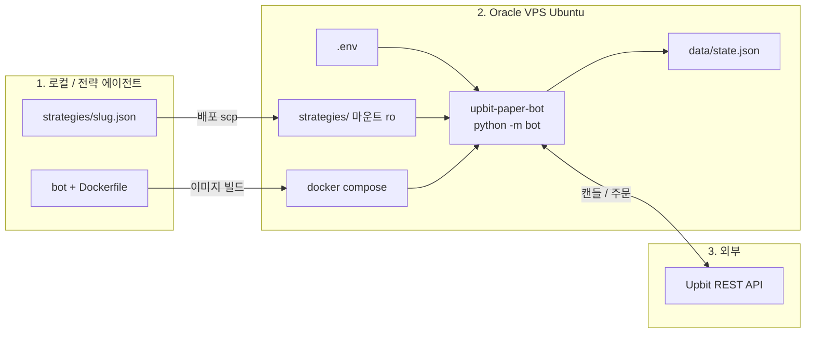
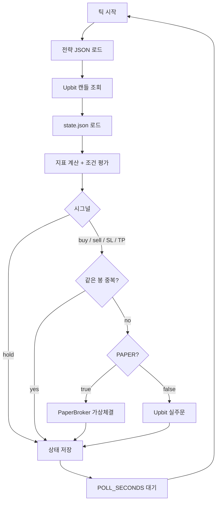
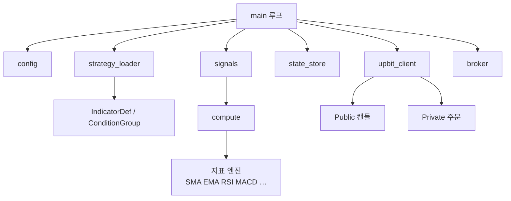
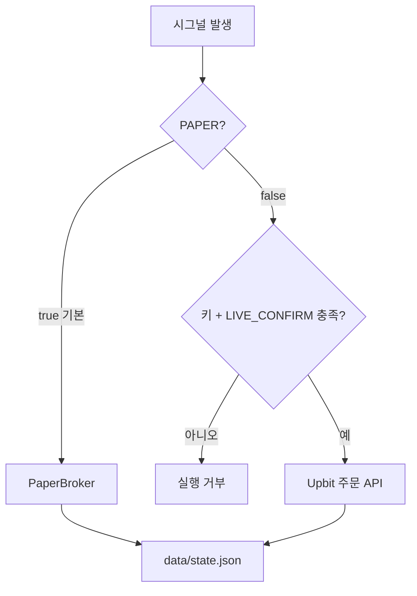

# 업비트 Docker 자동매매 봇 — 시스템 모식도

Oracle VPS Ubuntu에서 Docker Compose로 상시 실행되는 PAPER/LIVE 봇의 구조입니다.

---

## 1. 배포 구성

로컬에서 전략·코드를 만들고, Oracle VPS의 컨테이너가 Upbit API와 통신합니다.



**데이터 흐름 요약**

| 방향 | 내용 |
|------|------|
| 로컬 → VPS | 전략 JSON 복사, 이미지 빌드 |
| VPS 호스트 → 컨테이너 | `.env`, `strategies/`(ro), `data/` |
| 컨테이너 → Upbit | 캔들 조회, (LIVE일 때) 주문 |
| 컨테이너 → `data/state.json` | PAPER 잔고·포지션·체결 이력 |

| 구성요소 | 역할 |
|----------|------|
| `docker-compose.yml` | 빌드, 재시작, 볼륨·환경변수 |
| `strategies/` | 전략 JSON (읽기 전용) |
| `data/state.json` | PAPER 상태 영속화 |
| `.env` | `PAPER`, `STRATEGY_PATH`, `POLL_SECONDS` 등 |

---

## 2. 런타임 루프 (한 틱)



- 시그널은 **완성 봉**만 사용 (진행 중 봉 제외)
- `last_signal_bar`로 같은 봉 중복 체결 방지
- 포지션 중에는 `stop_loss` / `take_profit` 우선 검사

---

## 3. 봇 내부 모듈



| 모듈 | 책임 |
|------|------|
| `main` | 루프, 로깅, PAPER/LIVE 분기 |
| `strategy_loader` | 전략 JSON → 지표·조건 트리 |
| `compute` / `indicators` | OHLCV → 지표 시계열 |
| `signals` | 조건 평가 → buy/sell/hold/SL/TP |
| `broker` | PAPER 가상 체결 |
| `upbit_client` | REST 캔들·(옵션) 실주문 |
| `state_store` | `state.json` 영속화 |

---

## 4. PAPER vs LIVE



기본값은 **`PAPER=true`**. 실주문은 아래가 **모두** 있을 때만 허용됩니다.

- `UPBIT_ACCESS_KEY`
- `UPBIT_SECRET_KEY`
- `LIVE_CONFIRM=I_UNDERSTAND_LIVE_TRADING_RISK`

---

## 5. 전략 → 봇 연결

```text
전략 에이전트
  └─ strategies/{slug}.json
        │
        ▼
.env  STRATEGY_PATH=/app/strategies/{slug}.json
        │
        ▼
docker compose up -d --build
  └─ upbit-paper-bot 이 해당 JSON으로 폴링
```

지원: 지표 15종, `indicator` / `field` / `literal`(+offset), `gt|lt|gte|lte|eq|cross_*`, nested AND/OR, SL/TP.
