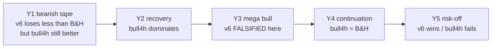

# 5-Year Sequential Validation Report

> Window: `2021-07-27` → `2026-07-26` UTC · Market: KRW-BTC  
> Toolkit stdout only. Fees on. No slippage / book / partial fills.  
> **Not investment advice. Past ≠ future.**

## Verdict (falsification-first)

| Hypothesis | Result |
|------------|--------|
| Always run ACTIVE bear strategy **m5-v6** for 5 years | **FALSIFIED** — full-span return **-14.18%** vs B&H **+117.89%**, MDD **-33.28%**, PF **1.06** |
| Use **regime Policy C** (bull/transition→4h trend, bear→m5-v6, sideways→MR v4) | **RETAINED vs always-v6** — segment-chain compound **+336.25%** (bull v1) / **+415.41%** (bull v2) vs B&H chain **~+87%** |
| Current LIVE should stay on m5-v6 while regime=BEAR | **OK** — Y5 and recent deep-bear windows favor v6 over bull4h |

---

## 1) Yearly sequential matrix (ACTIVE m5-v6 vs siblings)

| Year | Period | B&H | **m5-v6** | CAGR | MDD | PF | n | bull4h (v1) | sw4 |
|------|--------|----:|----------:|-----:|----:|---:|--:|------------:|----:|
| Y1 | 21-07-27~22-07-26 | -35.28% | **-15.56%** | -15.60% | -20.97% | 0.73 | 57 | **+1.84%** | -15.04% |
| Y2 | 22-07-27~23-07-26 | +33.91% | **-3.47%** | -3.47% | -13.08% | 1.02 | 38 | **+64.22%** | +13.82% |
| Y3 | 23-07-27~24-07-26 | +145.71% | **-7.84%** | -7.84% | -10.24% | 0.85 | 51 | **+154.85%** | +3.71% |
| Y4 | 24-07-27~25-07-26 | +69.03% | **-0.19%** | -0.19% | -11.84% | 1.19 | 57 | **+70.86%** | +15.50% |
| Y5 | 25-07-27~26-07-26 | -41.33% | **+13.98%** | +14.02% | -6.44% | **2.15** | 45 | -16.25% | -2.43% |

### Year-chain compounds (multiply yearly total returns)

| Policy | 5y sequential compound |
|--------|----------------------:|
| Always m5-v6 | **-14.54%** |
| Always m5-v3 | **-58.44%** |
| Always bull4h v1 | **+509.89%** |
| Oracle (best of v6/bull/sw each year) | **~+730%** |
| Buy&hold year-chain | **+111.18%** |



**Reading:** m5-v6 is a **bear/risk-off specialist**, not a 5-year always-on engine. Using it every year is the wrong hypothesis.

---

## 2) Full-span always-on (single backtest)

| Strategy | Period | Total | CAGR | MDD | PF | Trades | B&H |
|----------|--------|------:|-----:|----:|---:|-------:|----:|
| m5-v6 | 2021-07-27~2026-07-26 | **-14.18%** | -3.01% | -33.28% | 1.06 | 248 | +117.89% |

---

## 3) Regime Policy C over 5y labeled segments

Regime engine v2 daily labels from ~2020-07 history; evaluate `2021-07-27`…`2026-07-26` (36 segments).

| Map | Segment-chain compound | B&H chain |
|-----|----------------------:|----------:|
| Policy C + bull **v1** (EMA8/21) | **+336.25%** | +87.46% |
| Policy C + bull **v2** (EMA5/20) | **+415.41%** | +87.46% |
| Always v6 on same segments | -11.55% | ~+89% |
| Always bull4h v1 | +155.79% | ~+97% |
| Oracle (best of v6/bull/sw per segment) | +768.57% | ~+99% |

### Improvement shipped from this review

Weakest bull segment under Policy C v1:

- `2021-10-01`…`2021-12-03` bull: **-13.30%** vs B&H **+31.25%**

Sweep kept Y3/Y4 strength and lifted that window:

| | w2021 bull seg | Y3 year | Y4 year | Y5 year |
|--|--:|--:|--:|--:|
| bull4h v1 EMA8/21 | -13.30% | +154.85% | +70.86% | -16.25% |
| **bull4h v2 EMA5/20** | **-3.48%** | +136.8% | +71.8% | -14.3% |

→ Saved as `strategies/regime-bull-trend-4h-v2.json` and wired into Policy C for **bull + transition**.

---

## 4) What we did / did not change on LIVE

| Item | Action |
|------|--------|
| ACTIVE / LIVE bot | **Keep m5-v6** (current regime BEAR; Y5 evidence supports) |
| Policy map bull/transition | **Upgrade to bull4h-v2** for next regime flip |
| Claim “v6 prints money for 5 years” | **Rejected** by sequential evidence |

---

## 4b) AE4 non-EMA bull family (2026-07-28)

Tried MACD / DI / Ichimoku / SMA / CCI / StochRSI / OBV as full replacements for bull-v2.
**None beat Policy C 5y compound +425.85%.** Local 2021-10 winners (SMA10/50 +33%, OBV +20%) lose on the chain.
Keep bull-v2. Details: `reports/improve/20260728-ae4-bull-family.md`.

## 5) Agent file index

```text
reports/five-year/summary.json
reports/five-year/policyC-5y-path.json
reports/five-year/policyC-5y-v2-path.json
reports/five-year/oracle-5y-path.json
reports/regimes-krw-btc-1d-5y.json
reports/five-year/m5-v6-Y1.txt … m5-v6-FULL5.txt
strategies/regime-bull-trend-4h-v2.json
```

---

## Disclaimers

- 슬리피지, 호가창 유동성, 부분 체결은 반영되지 않으며 다음 캔들 시가에 전량 체결로 가정합니다.
- 백테스트 결과는 과거 데이터를 기초로 한 것이며, 장래 또는 실제 거래에서 동일하거나 유사한 투자 성과로 이어질 것임을 보장하지 않습니다.
- Upbit Strategy Toolkit은 특정 종목·시점·전략을 추천하지 않습니다. 거래 책임은 이용자에게 있습니다.
